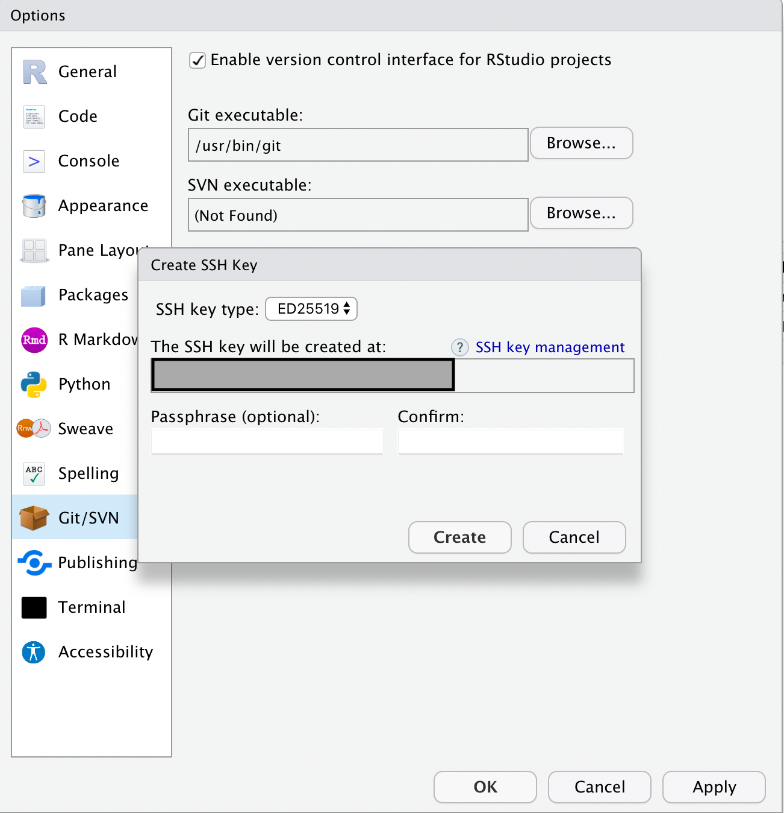

```{r setup, include=FALSE}
knitr::opts_chunk$set(echo = TRUE)
```

## Step 1: Register Github

Go to github.com to register an account on GitHub.

## Step 2: Setup Github Authentication in Rstudio

After you have registered on GitHub, the next thing you should do is to setup your local RStudio so that it can retrieve data from and upload data to GitHub.

Tools ---\> Global Option ---\> Git/SVN

### Step 2a: Make a SSH key

*Reader further: [What is a SSH key?](https://www.ssh.com/academy/ssh-keys)*

Click "Create SSH Key..." Leave all settings as default. You may leave "Passphrase (optional)" and "Confirm" empty.

{width="406"}

{width="406"}

### Step 2b: Copy information of your SSH key

After you have successfully created your SSH key, click "View public key." Copy ALL the text in the pop-up window to your clipboard.

{width="426"}

{width="428"}

### Step 2c: Put information of your (public) SSH key in GitHub

Click on your profile picture at the top right corner.

{width="201"}

In the pop-up menu, click "Settings"

{width="221"}

In the navigation bar located in the column in the left, click ""SSH and GPG keys."

{width="219"}

It will open a page that lists all your existing SSH keys. Click the button "New SSH key"

{width="482"}

It will open a page titled "Add new SSH Keys." In the "Title" field, you may input any name of your choice (preferably one that tells you which machine this key is stored). In the "Key" field, input the text you have copied in RStudio in **Step 2**.

{width="391"}

Click the green button "Add SSH key" and GitHub will direct you back to the "SSH Key" page. If your key is added successfully, you should be able to see its title and information in the "Authentication Keys" section. You may delete it when it becomes relevant.

*WARNING: For your account's security, if you discard a device, you would definitely want to delete the SSH key associated with it.*

## Step 3: Clone the in-class demo repo to your local device

By now, you have set up GitHub and are ready to use it. In this step, you will *clone* a copy of the course's GitHub Repo to your local device. We are doing this for two purposes. (1) You can stay up-to-date with the our teaching and learning materials. (2) You may follow the same steps to clone any GitHub repo to your local device.

To start with, please go to File --\> New Project

{width="266"}

In the pop-up window, choose "Version Control."

{width="406"}

Then, choose "Git."

{width="407"}

Up next, you will be asked to input (1) the information of the Git repo you would like to clone and (2) the local locations where you want to store the cloned repo.

{width="415"}

You can obtain "Repository URL" from the webpage of your GitHub project. For the course's GitHub repo, go to <https://github.com/haohanchen/HKU_POLI3148_23Fall> and click the green "Code" button. In the pop-up tab, choose "SSH," then copy the whole address starting with `git@github.com` (using the button on the right).

{width="640"}

Now, go back to RStudio. Paste the address in the "Repository URL" field. If the address is correct, the field "Project directory name" will be automatically filled with the name of your GitHub project. I would recommend that you keep the default name (i.e., not making any change to to auto-filled names). But it is fine if you want to change it to a different name for self-reference.

In the field "Create project as subdirectory of," please choose the location where you want the cloned repo to stay. It can be anywhere of your choice.

{width="465"}

When all the above are done, click "Create Project." If will take Rstudio and Git a while to download the project data. You will know it is successful when the repo is opened in R.

## Step 4: Setup your own "DaSPPA Portfolio" on GitHub

Your final step is to set up a directory to hold your DaSPPA portfolio. To create a new repository, click the green "New" button at the top left corner of your GitHub homepage.

{width="235"}

It will direct you to a page where you can specify some basic configuration of your GitHub repo. I assume most of the options are self-explanatory. Below are some explanation of a selection of options.

-   Ticking "Add a README file" will add a file named `README.md` in the root of your repository. You may use the `README.md` to document important information of your repository.

-   "Add `.gitignore`" adds a hidden file at the root of a repository telling Git what files or folders you **DO NOT** wish to track change or push online. These include large data files and temporary files. As our repository will contain mostly R programs, please choose "`R`" in the drop-down menu.

{width="551"}
