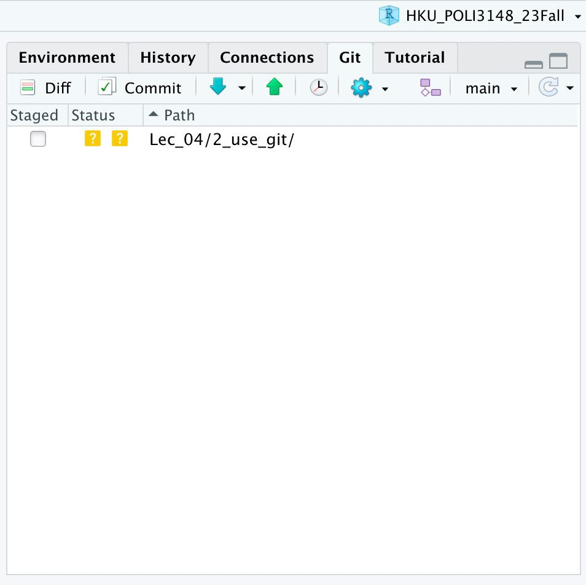
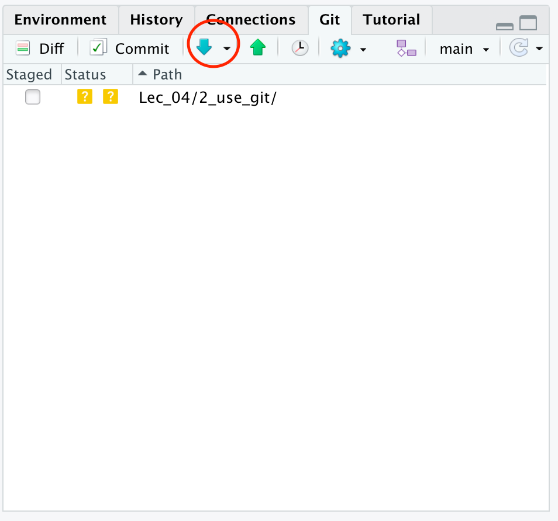
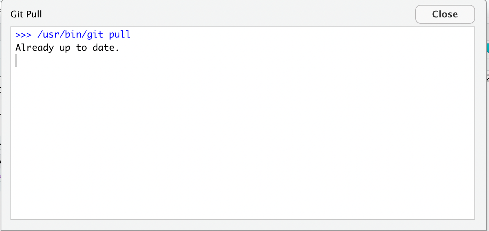
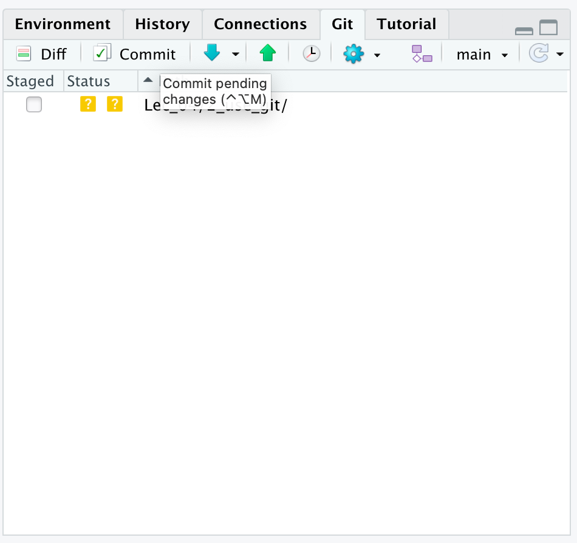
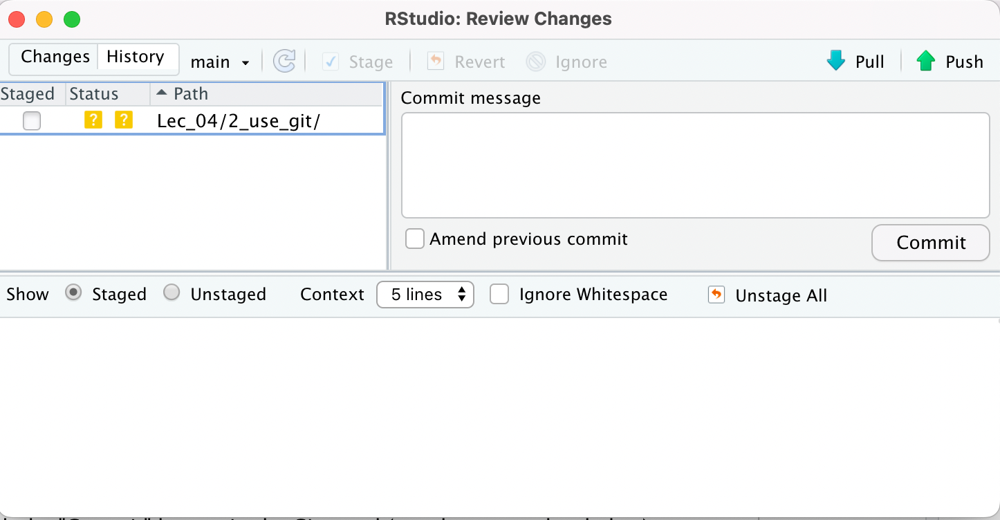
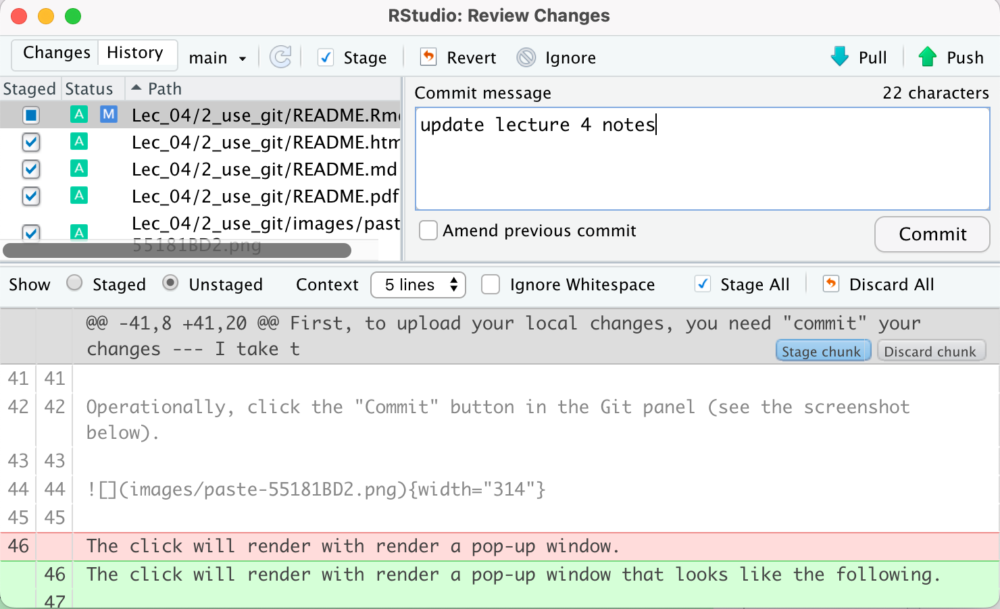
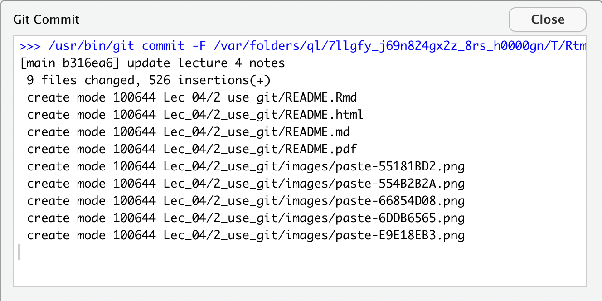
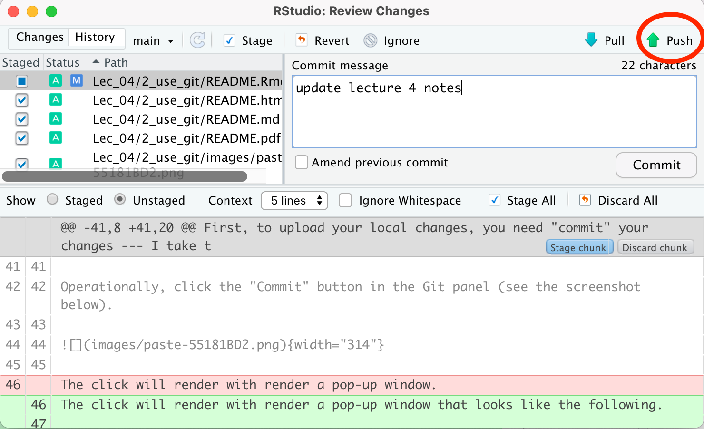

After you have set up a *Version Control* R project following
instructions in
[1\_setup\_git](https://github.com/haohanchen/HKU_POLI3148_23Fall/tree/main/Lec_04/1_setup_git),
you can then use Rstudio to synchronize your local repository with your
online repositories on GitHub. You can perform these operations using
the “Git” panel that by default shows up at the top-left area of your
Rstudio interface. See below a screenshot of the panel.

In this note, I will introduce how you may retrieve updates from an
online GitHub repo and upload local updates to your online GitHub repo.

## Retrieve Updates from an Online Repo

To retrieve update from an online GitHub repo, simply click the blue
downward arrow. Clicking the button will render a pop-up window. When
the update is done, a line of text “Already up to date” will show up in
the pop-up window. And you will need to manually close it by clicking
“Close.”

**Note:** a small drop-down menu you to the right of the “Pull” button
gives you an option to “Pull with Rebase.” This is a function you should
use with extreme caution. If you choose to pull with rebase, then, the
update will **OVERWITE ALL YOUR LOCAL CHANGES**. If you are working with
a project folder that you are updating locally, doing it will cause loss
of all recent updates!

## Upload Local Updates to an Online Repo

Updating your folder takes two steps: commit and push —- I assume the
two-step process to be less intuitive for new Git users and requires
some elaboration.

### Commit

First, to upload your local changes, you need “commit” your changes — I
take this step as an intermediate step where you can (1) examine what
exact changes have been made, (2) select a subset of changes you want to
upload (but for most of the time I’d go with ALL to avoid confusion, and
(3) add a note describing the nature of your changes.

Operationally, click the “Commit” button in the Git panel (see the
screenshot below).

The click will render with render a pop-up window that looks like the
following.

The top-left panel list all the changes you have made since the latest
synchronization. The first operation I’d do is to select (“stage”) all
by clicking the checkboxes under the “staged” column. To safe time,
instead of clicking on the checkboxes, I’d select-all using Control+A or
Cmd+A and press SPACE or ENTER to check all the boxes. After you do so,
the interface will change into something that looks like the screenshot
below.

You may observe two things. First, the list of files at the top-left
panel gets longer. That is because before after checking the checkboxes,
it shows each changed files individually (as oppose to showing folder
names prior checking).

Second and more importantly, you will start to see content in the bottom
panel. This shows the exact changes you have made to your files. Text
with a GREEN background means addition. Text with a RED background means
deletion. You can click on the paths of different files to track changes
in individual files (but don’t click on the checkboxes because that will
“unstage” them).

Here comes the final step. After you have examined your changes and are
satisfied with them, use the top-right panel “Commit message” to briefly
summarize the nature of your update. Keep it brief and do not use any
special character in this message. For example, I type “update lecture 4
notes” for this one.

After adding your “Commit message,” you may click the “Commit” button.
It will render a pop-up window that shows the progress (see the
screenshot below for an example). When it stops moving, click the
“Close” button.

### “Push”

After taking the time to review and confirm your changes in the “Commit”
step, you are ready to “push” the update online. This step is much more
straightforward. Simply click the “Push” button at the top-right corner
(see the screenshot below).

**Note:** If this is a collaborative project (i.e., others may be
simultaneously updating the GitHub repo), then after “Commit,” you
should first “Pull” updates in the online folder before you “Push.” In
this case, after you “Commit,” first click “Pull” to retrieve the latest
updates and then click “Push” to upload your local updates.
