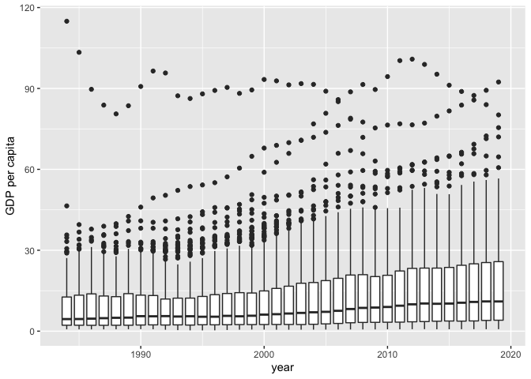

## Load packages

This section loads the packages we need in this lecture.

    library(tidyverse)

## Load data

This section loads the VDEM dataset and describe its basic information

    d <- read_csv("_DataPublic_/vdem/1984_2022/vdem_1984_2022_external.csv")

    ## Rows: 6789 Columns: 211
    ## ── Column specification ────────────────────────────────────────────────────────
    ## Delimiter: ","
    ## chr    (3): country_name, country_text_id, histname
    ## dbl  (207): country_id, year, project, historical, codingstart, codingend, c...
    ## date   (1): historical_date
    ## 
    ## ℹ Use `spec()` to retrieve the full column specification for this data.
    ## ℹ Specify the column types or set `show_col_types = FALSE` to quiet this message.

## Check Basic Information of the Dataset

    dim(d)

    ## [1] 6789  211

## Select Variables (Columns) of Interest

    d_s <- d |>
      select(country_name, country_id, year, e_fh_cl, e_gdp, e_gdppc)

    d_s

    ## # A tibble: 6,789 × 6
    ##    country_name country_id  year e_fh_cl   e_gdp e_gdppc
    ##    <chr>             <dbl> <dbl>   <dbl>   <dbl>   <dbl>
    ##  1 Mexico                3  1984       4  93563.    11.7
    ##  2 Mexico                3  1985       4  94259.    11.5
    ##  3 Mexico                3  1986       4  92750.    11.1
    ##  4 Mexico                3  1987       4  93220.    10.9
    ##  5 Mexico                3  1988       4  94687.    10.8
    ##  6 Mexico                3  1989       3  98145.    11.0
    ##  7 Mexico                3  1990       4 103254.    11.4
    ##  8 Mexico                3  1991       4 107374.    11.6
    ##  9 Mexico                3  1992       3 111533.    11.9
    ## 10 Mexico                3  1993       4 114611.    12.0
    ## # ℹ 6,779 more rows

## Rename Variables of Interest

    d_s <- d_s |>
      rename("FH Civil Liberty" = "e_fh_cl",
             "GDP" = "e_gdp", 
             "GDP per capita" = "e_gdppc")

    # Check out functions that can allow you to rename variables in batch

## Filter Observations (Rows) of Interest

For our analysis, we want to focus on data points from 2010 to 2020

    d_s_2010_2020 <- d_s |> filter(year >= 2000 & year <= 2020)

    d_s |>
      ggplot(aes(x = `year`, y = `GDP per capita`, group = year)) +
      geom_boxplot()

    ## Warning: Removed 688 rows containing non-finite values (stat_boxplot).

