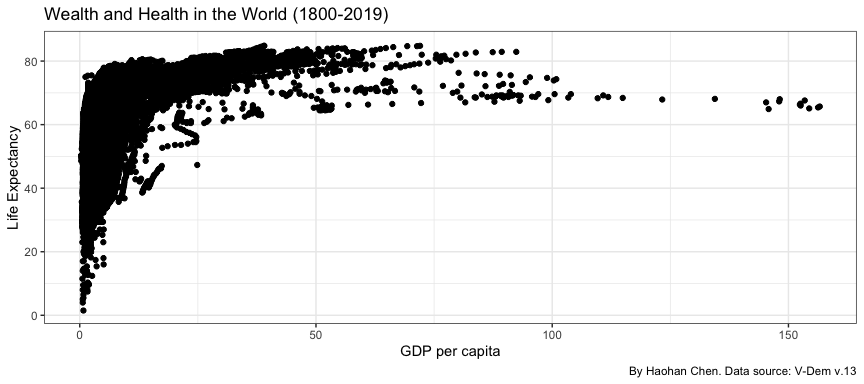
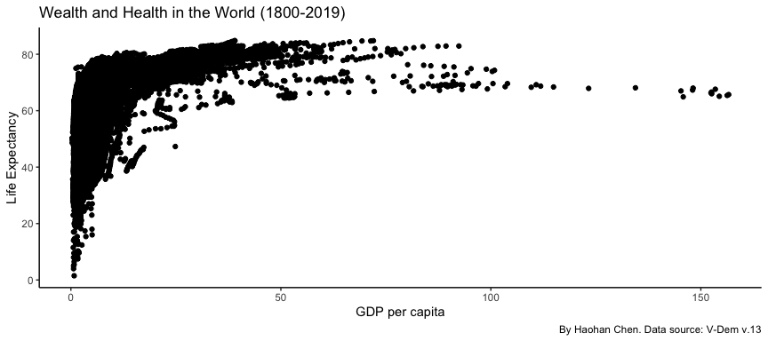
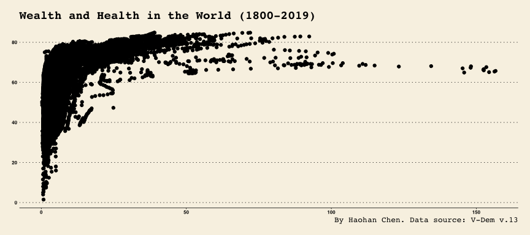

# Motivation

## Data Visualization

Life is short. Use graphs!

What does data visualization do? Let’s start with some examples.

-   Hans Roling’s Gapminder: <https://www.gapminder.org/tools/>

-   Our World in Data: <https://ourworldindata.org/>

-   V-Dem data visualization tools:
    <https://v-dem.net/graphing/graphing-tools/>

## Our Task: Extend the “Health and Wealth” Analysis

<https://www.gapminder.org/fw/world-health-chart/>

> Hans Rosling shows that income and health go hand in hand. People live
> longer in richer countries. Or the other way around. Countries are
> richer where people live longer. There are no high income countries
> with a short life expectancy, and no low income countries with a long
> life expectancy. Still, there’s a huge difference in life expectancy
> between countries on the same income level, depending on how the money
> is distributed and how it is used.

## Our Task: Extend the “Health and Wealth” Analysis

<https://www.gapminder.org/fw/world-health-chart/>


# Data Preparation

## Load the Data

``` r
library(tidyverse)

d_full <- bind_rows(
  read_csv("_DataPublic_/vdem/1789_1827/vdem_1789_1827_external.csv"),
  read_csv("_DataPublic_/vdem/1867_1905/vdem_1867_1905_external.csv"),
  read_csv("_DataPublic_/vdem/1906_1944/vdem_1906_1944_external.csv"),
  read_csv("_DataPublic_/vdem/1945_1983/vdem_1945_1983_external.csv"),
  read_csv("_DataPublic_/vdem/1984_2022/vdem_1984_2022_external.csv")
)
```

## Select Indicators of Interest

-   Country-year identifiers `country_text_id` `year`

-   Region `e_regiongeo`

-   Wealth: GDP per capita `e_gdppc`

-   Health: Life expectancy `e_pelifeex`

-   Population: `e_mipopula` `e_sb_pop`

-   Extension: Democracy

    -   Binary “democracy” indicator `e_boix_regime`

    -   The Lexical index of Electoral Democracy `e_lexical_index`

    -   Polity V scores (-10 to +10) `e_p_polity`

## Select Indicators of Interest (con’d)

``` r
d <- d_full |>
  select(
    country_text_id, year, 
    e_regiongeo, e_pelifeex, e_gdppc, 
    e_mipopula, e_wb_pop,
    e_boix_regime, e_lexical_index, e_p_polity) |>
  rename("region" = "e_regiongeo", 
         "life_expectancy" = "e_pelifeex", 
         "gdppc" = "e_gdppc",
         "population_ClioInfra" = "e_mipopula", 
         "population_WorldBank" = "e_wb_pop",
         "democracy_binary" = "e_boix_regime",
         "democracy_lexical" = "e_lexical_index",
         "democracy_polity5" = "e_p_polity") |>
  filter(year >= 1800)

saveRDS(d, "Lec_07/data/wealth_and_health.rds")
```

## Take a Quick Look at the Data

``` r
summary(d)
```

    ##  country_text_id         year          region      life_expectancy
    ##  Length:23593       Min.   :1800   Min.   : 1.00   Min.   : 1.50  
    ##  Class :character   1st Qu.:1912   1st Qu.: 5.00   1st Qu.:35.50  
    ##  Mode  :character   Median :1952   Median : 9.00   Median :50.30  
    ##                     Mean   :1944   Mean   : 9.46   Mean   :51.37  
    ##                     3rd Qu.:1989   3rd Qu.:14.00   3rd Qu.:67.10  
    ##                     Max.   :2022   Max.   :19.00   Max.   :85.30  
    ##                                                    NA's   :1232   
    ##      gdppc         population_ClioInfra population_WorldBank democracy_binary
    ##  Min.   :  0.286   Min.   :     17.9    Min.   :4.170e+04    Min.   :0.000   
    ##  1st Qu.:  1.599   1st Qu.:   1021.9    1st Qu.:2.348e+06    1st Qu.:0.000   
    ##  Median :  2.774   Median :   3522.3    Median :7.144e+06    Median :0.000   
    ##  Mean   :  7.194   Mean   :  18688.0    Mean   :3.239e+07    Mean   :0.364   
    ##  3rd Qu.:  7.606   3rd Qu.:   9718.8    3rd Qu.:2.103e+07    3rd Qu.:1.000   
    ##  Max.   :156.628   Max.   :1262645.0    Max.   :1.412e+09    Max.   :1.000   
    ##  NA's   :4571      NA's   :7173         NA's   :13583        NA's   :7623    
    ##  democracy_lexical democracy_polity5
    ##  Min.   :0.000     Min.   :-88.000  
    ##  1st Qu.:0.000     1st Qu.: -7.000  
    ##  Median :2.000     Median : -3.000  
    ##  Mean   :2.338     Mean   : -3.616  
    ##  3rd Qu.:4.000     3rd Qu.:  7.000  
    ##  Max.   :6.000     Max.   : 10.000  
    ##  NA's   :675       NA's   :8195

## Region


## Democracy Indicators: Boix et al. 2013


## Democracy Indicators: Lexical Index


## Democracy Indicators: Polity V


## Democracy Indicators (further readings)

In addition to the V-Dem dataset, check out more data of democracy
indicators

<https://xmarquez.github.io/democracyData/index.html>

## Problem: Multiple Population Data Sources!

We have two population data sources, with different coverage of years.


## Multiple Population Data Sources

Consistency? Check years that are available in both datasets.

``` r
d_pop_overlap <- d |> select(country_text_id, year, starts_with("population_")) |> 
  drop_na()
print(d_pop_overlap, n = 3)
```

    ## # A tibble: 5,818 × 4
    ##   country_text_id  year population_ClioInfra population_WorldBank
    ##   <chr>           <dbl>                <dbl>                <dbl>
    ## 1 MEX              1960               38578.             37771861
    ## 2 MEX              1961               39998.             38966049
    ## 3 MEX              1962               41418.             40195318
    ## # ℹ 5,815 more rows

``` r
unique(d_pop_overlap$year)
```

    ##  [1] 1960 1961 1962 1963 1964 1965 1966 1967 1968 1969 1970 1971 1972 1973 1974
    ## [16] 1975 1976 1977 1978 1979 1980 1981 1982 1983 1984 1985 1986 1987 1988 1989
    ## [31] 1990 1991 1992 1993 1994 1995 1996 1997 1998 1999 2000

``` r
cor(d_pop_overlap$population_ClioInfra, d_pop_overlap$population_WorldBank)
```

    ## [1] 0.9997128

## Set a Rule to Merge the Two Population Columns

-   Different units: Divide `population_WorldBank` by 1000 (so that the
    unit of population is “in thousands”

-   Different coverage but almost perfect correlation

    -   For years that only one dataset has coverage, take the value
        from the dataset that has available data points.

    -   For years that both datasets have coverage, take their `mean`.

That means, effectively, we are taking the `mean` and allow
`na.rm = TRUE`. Think about it.

## Merge the Two Population Columns

Below is an implementation of the rule we have just set. The output of
this step is a new variable called `population` which aggregate data
from both sources.

``` r
# STEP 1: "Harmonize" the units
d <- d |> mutate(population_WorldBank = population_WorldBank / 1000)

# STEP 2 Method 1: Slower but use only tidyverse functionality
# [Slow! Not recommended!]
d <- d |> rowwise() |>
  mutate(population = mean(c_across(c("population_ClioInfra", "population_WorldBank")), 
                           na.rm = TRUE), .after = population_WorldBank) |>
  ungroup()

# STEP 2 Method 2: Faster but use a non-tidyverse function rowMeans() 
# and create a temporary vector tmp_population, which I remove after use with rm()
# [Faster !Recommended!]
tmp_population <- d |> select(population_ClioInfra, population_WorldBank) |> rowMeans(na.rm = TRUE)
d <- d |> mutate(population = !!(tmp_population), .after = population_WorldBank)

rm(tmp_population)

# Remove the columns we no longer need
d <- d |> select(-population_ClioInfra, -population_WorldBank)
```

## Sanity Check

``` r
summary(d %>% select(-country_text_id, -year, -region))
```

    ##  life_expectancy     gdppc           population        democracy_binary
    ##  Min.   : 1.50   Min.   :  0.286   Min.   :     17.9   Min.   :0.000   
    ##  1st Qu.:35.50   1st Qu.:  1.599   1st Qu.:   1246.3   1st Qu.:0.000   
    ##  Median :50.30   Median :  2.774   Median :   4234.3   Median :0.000   
    ##  Mean   :51.37   Mean   :  7.194   Mean   :  23083.3   Mean   :0.364   
    ##  3rd Qu.:67.10   3rd Qu.:  7.606   3rd Qu.:  11914.2   3rd Qu.:1.000   
    ##  Max.   :85.30   Max.   :156.628   Max.   :1412360.0   Max.   :1.000   
    ##  NA's   :1232    NA's   :4571      NA's   :2981        NA's   :7623    
    ##  democracy_lexical democracy_polity5
    ##  Min.   :0.000     Min.   :-88.000  
    ##  1st Qu.:0.000     1st Qu.: -7.000  
    ##  Median :2.000     Median : -3.000  
    ##  Mean   :2.338     Mean   : -3.616  
    ##  3rd Qu.:4.000     3rd Qu.:  7.000  
    ##  Max.   :6.000     Max.   : 10.000  
    ##  NA's   :675       NA's   :8195

*Always watch out for when you see `NA`, especially when the number is
non-trivial!*

## Check Data Availability

``` r
check_data_available <- d |> 
  mutate(Available = (!is.na(life_expectancy) & !is.na(gdppc) & !is.na(population))) 
# Check number of missing values by country-year
table(check_data_available$Available, useNA = "always")
```

    ## 
    ## FALSE  TRUE  <NA> 
    ##  6003 17590     0

``` r
check_data_available |> print(n = 3)
```

    ## # A tibble: 23,593 × 10
    ##   country_text_id  year region life_expectancy gdppc population democracy_binary
    ##   <chr>           <dbl>  <dbl>           <dbl> <dbl>      <dbl>            <dbl>
    ## 1 MEX              1800     17            26.9  1.35      5100                NA
    ## 2 MEX              1801     17            26.9  1.34      5174.               NA
    ## 3 MEX              1802     17            26.9  1.32      5249.               NA
    ## # ℹ 23,590 more rows
    ## # ℹ 3 more variables: democracy_lexical <dbl>, democracy_polity5 <dbl>,
    ## #   Available <lgl>

## Check Data Availability (con’d)

``` r
check_data_available_wide <- check_data_available |>
  select(country_text_id, year, Available) |>
  pivot_wider(names_from = "country_text_id", values_from = "Available", 
              names_prefix = "c_") |>
  arrange(year)

check_data_available_wide |> print(n = 3)
```

    ## # A tibble: 184 × 203
    ##    year c_MEX c_SWE c_CHE c_JPN c_MMR c_RUS c_EGY c_YEM c_COL c_POL c_BRA c_USA
    ##   <dbl> <lgl> <lgl> <lgl> <lgl> <lgl> <lgl> <lgl> <lgl> <lgl> <lgl> <lgl> <lgl>
    ## 1  1800 TRUE  TRUE  TRUE  TRUE  FALSE FALSE TRUE  FALSE TRUE  NA    TRUE  FALSE
    ## 2  1801 TRUE  TRUE  TRUE  TRUE  FALSE FALSE TRUE  FALSE TRUE  NA    TRUE  FALSE
    ## 3  1802 TRUE  TRUE  TRUE  TRUE  FALSE FALSE TRUE  FALSE TRUE  NA    TRUE  FALSE
    ## # ℹ 181 more rows
    ## # ℹ 190 more variables: c_PRT <lgl>, c_BOL <lgl>, c_HTI <lgl>, c_PER <lgl>,
    ## #   c_VDR <lgl>, c_AFG <lgl>, c_ARG <lgl>, c_ETH <lgl>, c_IND <lgl>,
    ## #   c_KOR <lgl>, c_THA <lgl>, c_VEN <lgl>, c_IDN <lgl>, c_NPL <lgl>,
    ## #   c_AUS <lgl>, c_CHL <lgl>, c_FRA <lgl>, c_DEU <lgl>, c_GTM <lgl>,
    ## #   c_IRN <lgl>, c_LBR <lgl>, c_MAR <lgl>, c_NLD <lgl>, c_ESP <lgl>,
    ## #   c_TUN <lgl>, c_TUR <lgl>, c_GBR <lgl>, c_URY <lgl>, c_CHN <lgl>, …

## Check Data Availability (con’d)

``` r
# Check, for each year, the availability of each column
check_data_available_by_column <- d |>
  group_by(year) |>
  summarise(
    life_expectancy = sum(is.na(life_expectancy)),
    gdppc = sum(is.na(gdppc)),
    population = sum(is.na(population))
  )
  # summarise_at(vars(life_expectancy, gdppc, population), ~sum(!is.na(.))) 
  # above is an alternative way to write the summarise() step

check_data_available_by_column |> print(n = 3)
```

    ## # A tibble: 184 × 4
    ##    year life_expectancy gdppc population
    ##   <dbl>           <int> <int>      <int>
    ## 1  1800              16    31         25
    ## 2  1801              16    31         25
    ## 3  1802              17    32         26
    ## # ℹ 181 more rows

## Save Cleaned Data

**OK. All look good! We are ready to create some beautiful data
visualization.**

``` r
dir.create("Lec_07/data")
```

    ## Warning in dir.create("Lec_07/data"): 'Lec_07/data' already exists

``` r
saveRDS(d, "Lec_07/data/wealth_and_health.rds")
```

# Data Viz Basics

## Simplest Possible Visualization

Plot a scatter plot with ALL the data points.

``` r
d |> 
  ggplot(aes(x = gdppc, y = life_expectancy)) + 
  geom_point() +
  labs(x = "GDP per capita", y = "Life Expectancy", 
       title = "Wealth and Health in the World (1800-2019)",
       caption = "By Haohan Chen. Data source: V-Dem v.13")
```


## Store Your First Data Visualization

To make your nice data visualization stay. You can either (temporarily)
save it in your R Environment, or save it as a file in your folder.

``` r
# Store in R environment (temporary)
p_all <- d |> 
  ggplot(aes(x = gdppc, y = life_expectancy)) + 
  geom_point() +
  labs(x = "GDP per capita", y = "Life Expectancy", 
       title = "Wealth and Health in the World (1800-2019)",
       caption = "By Haohan Chen. Data source: V-Dem v.13")
# Save plot as a .rds file in your folder
dir.create("Lec_07/1_data_visualization_1/figures")
saveRDS(p_all, "Lec_07/1_data_visualization_1/figures/welath_and_health_all.rds")
# Save plot as a PDF file in your folder
ggsave(filename = "Lec_07/1_data_visualization_1/figures/welath_and_health_all.pdf", 
       plot = p_all, width = 9, height = 4)
```

## Set Themes: `theme_bw`

``` r
p_all + theme_bw()
```



## Set Themes: `theme_classic`

``` r
p_all + theme_classic()
```



## Set Themes: `theme_minimal`

``` r
p_all + theme_minimal()
```


## Other Fancy Themes: The Economist

``` r
# install.packages("ggthemes") # install the package upon your first use.
# Take a look at the package's website: https://yutannihilation.github.io/allYourFigureAreBelongToUs/ggthemes/
library(ggthemes)
p_all + theme_economist()
```


## Other Fancy Themes: The WSJ

``` r
p_all + theme_wsj(base_size = 6)
```


