## Objectives

Master data visualization methods with `ggplot`.

-   Housekeeping

    -   `ggplot` syntax

    -   Variable types

-   How to visualize everything

## Reading Materials on Data Visualization

-   \[Kabacoff\] Kabacoff, Rob. Data Visualization with R. 2020. E-book:
    [rkabacoff.github.io/datavis](https://rkabacoff.github.io/datavis/)

-   \[Healy\] Healy, Kieran. Data visualization: a practical
    introduction. Princeton University Press, 2018. E-book:
    [socviz.co](https://socviz.co/)

# Housekeeping

## Load Data

``` r
library(tidyverse)
theme_set(theme_bw()) # Set my default theme for the whole document

d <- readRDS("Lec_07/data/wealth_and_health.rds")
d |> print(n = 3)
```

    ## # A tibble: 23,593 × 9
    ##   country_text_id  year region life_expectancy gdppc population democracy_binary
    ##   <chr>           <dbl>  <dbl>           <dbl> <dbl>      <dbl>            <dbl>
    ## 1 MEX              1800     17            26.9  1.35      5100                NA
    ## 2 MEX              1801     17            26.9  1.34      5174.               NA
    ## 3 MEX              1802     17            26.9  1.32      5249.               NA
    ## # ℹ 23,590 more rows
    ## # ℹ 2 more variables: democracy_lexical <dbl>, democracy_polity5 <dbl>

## `ggplot` syntax

-   Consider: “Painting” your data on a canvas, layer by layer

-   Steps

    -   Specify the data you want to viaulize

    -   Specify the type(s) of visualization tools

    -   Label the figure (titles of the figure, axes, and legends)

-   Command: Use **`+`** to connect layers (ATTENTION: not `|>` )

Note: <u>***Always***</u> properly label your figures!

## `ggplot` syntax: example

``` r
d |> # Specify the data frame to plot
  ggplot(aes(x = gdppc, y = life_expectancy)) + # Specify the variables to plot
  geom_point() + # Choose the visualization tool: point
  labs(x = "GDP per capita", y = "Life Expectancy", # set up the axes' titles
       title = "Wealth and Health in the World (1800-2019)", # set up the figure's title
       caption = "By Haohan Chen. Data source: V-Dem v.13") # set up footnote
```

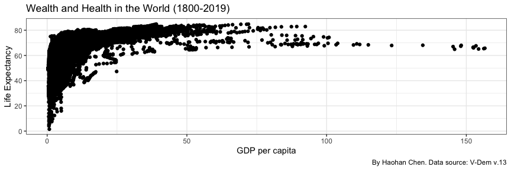

## Variable Types

Visualization tools to use largely depends on variable types

-   “Quantitative” (Continuous, Count)

    -   GDP per capita

    -   Life expectancy

    -   Population

    -   (Maybe) Polity V index

-   Categorical

    -   Binary: Binary “democracy” indicator

    -   Nominal: Region

    -   Ordinal: Lexical Index of Electoral Democracy

# Quant. X 1

## Viaulize One Quantitative Variable

-   Summary Statistics

    -   Min, max, median, mean, standard deviation, variance,

    -   Quantiles, quintiles

-   Visualization

    -   Histogram

    -   Density Plot

-   Advanced

    -   Skewed distribution

    -   Annotate cases

## Summary Statistics

``` r
summary(d$gdppc) # Quick summary
```

    ##    Min. 1st Qu.  Median    Mean 3rd Qu.    Max.    NA's 
    ##   0.286   1.599   2.774   7.194   7.606 156.628    4571

``` r
length(d$gdppc) # Number of observations
```

    ## [1] 23593

``` r
is.na(d$gdppc) |> sum() # Number of missing values
```

    ## [1] 4571

## Summary Statistics (con’d)

``` r
mean(d$gdppc, na.rm = TRUE) # Mean
```

    ## [1] 7.193588

``` r
var(d$gdppc, na.rm = TRUE) # Variance
```

    ## [1] 131.029

``` r
sd(d$gdppc, na.rm = TRUE) # Standard deviation
```

    ## [1] 11.44679

``` r
quantile(d$gdppc, na.rm = TRUE) # Quantile
```

    ##        0%       25%       50%       75%      100% 
    ##   0.28600   1.59900   2.77400   7.60575 156.62800

``` r
quantile(d$gdppc, seq(0, 1, 0.1), na.rm = TRUE) # Quintile
```

    ##       0%      10%      20%      30%      40%      50%      60%      70% 
    ##   0.2860   1.0451   1.4340   1.7760   2.1624   2.7740   4.0246   6.0687 
    ##      80%      90%     100% 
    ##   9.4364  18.7600 156.6280

## Histogram

``` r
d |> 
  ggplot(aes(x = gdppc)) +
  geom_histogram() + # Draw a histogram
  labs(x = "GDP per capita", y = "Count", title = "Histogram of GDP per capita")
```

    ## `stat_bin()` using `bins = 30`. Pick better value with `binwidth`.

    ## Warning: Removed 4571 rows containing non-finite values (stat_bin).


## Histogram (customized)

``` r
d |> ggplot(aes(x = gdppc)) + geom_histogram(bins = 10) +
  labs(x = "GDP per capita", y = "Count", title = "Histogram of GDP per capita")
```


``` r
d |> ggplot(aes(x = gdppc)) + geom_histogram(bins = 50, fill = "blue", color = "red") +
  labs(x = "GDP per capita", y = "Count", title = "Histogram of GDP per capita")
```

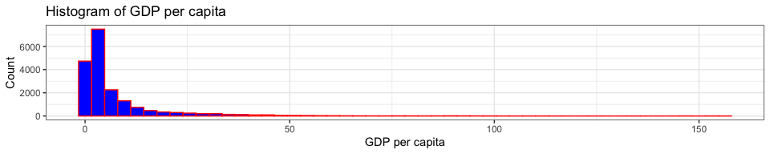

## Density

``` r
d |> 
  ggplot(aes(x = gdppc)) +
  geom_density() + # Draw a density plot
  labs(x = "GDP per capita", y = "Density", title = "Density of GDP per capita")
```

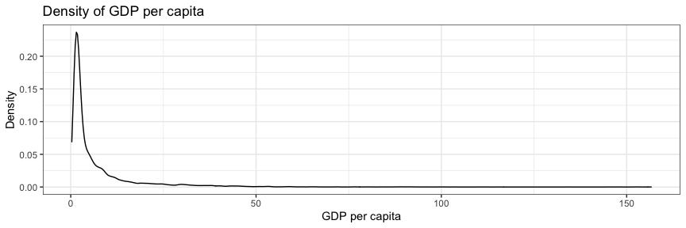

## Density (customized)

``` r
d |> 
  ggplot(aes(x = gdppc)) +
  geom_density(fill = "gray", color = "blue") + # Draw a density plot
  labs(x = "GDP per capita", y = "Density", title = "Density of GDP per capita")
```

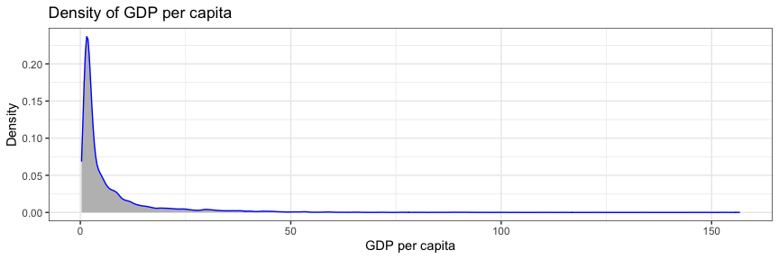

## Skewed Distribution

-   **Challenge:** Quantitative data may have skewed distributions,
    which can make the visualization uninformative.

-   **Solution:**

    -   Re-scale the axes

    -   Transform the variable(s)

## Skewed Distribution: Re-scale Axes

``` r
d |> ggplot(aes(x = gdppc)) + geom_histogram() +
  scale_x_sqrt() + # Scale the x axis to make distribution easy to read
  labs(x = "GDP per capita", y = "Count", title = "Histogram of GDP per capita")
```


``` r
d |> ggplot(aes(x = gdppc)) + geom_histogram() +
  scale_x_log10() + # Scale the x axis to make distribution easy to read
  labs(x = "GDP per capita", y = "Count", title = "Histogram of GDP per capita")
```


## Skewed Distribution: Transform Variables

Alternatively you can first transform the variable before your
visualization

``` r
d |> mutate(gdppc_sqrt = sqrt(gdppc)) |> # Transform the variable before visualization
  ggplot(aes(x = gdppc_sqrt)) + geom_histogram() +
  labs(x = "sqrt(GDP per capita)", y = "Count", title = "Histogram of GDP per capita")
```

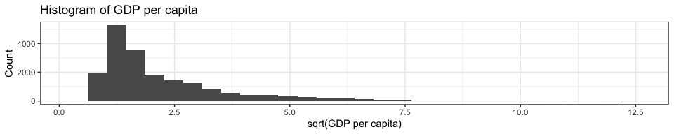

``` r
d |> mutate(gdppc_log = log(gdppc)) |> # Transform the variable before visualization
  ggplot(aes(x = gdppc_log)) + geom_histogram() +
  labs(x = "log(GDP per capita)", y = "Count", title = "Histogram of GDP per capita")
```

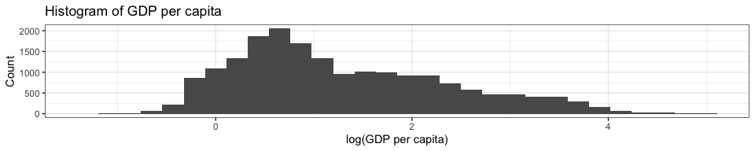

## Skewed Distribution: Note

``` r
summary(d$gdppc)
```

    ##    Min. 1st Qu.  Median    Mean 3rd Qu.    Max.    NA's 
    ##   0.286   1.599   2.774   7.194   7.606 156.628    4571

**The method only work when your variable contains NON-NEGATIVE values
only.**

## Annotate Case(s) of Interest

``` r
d |> ggplot(aes(x = gdppc)) + geom_histogram() +
  labs(x = "GDP per capita", y = "Count", title = "Histogram of GDP per capita")
```


## Annotate Case(s) of Interest (con’d)

``` r
d_anno <- d |> filter(country_text_id == "CHN", year == 2019) |> mutate(anno = paste(country_text_id, year), .after = year)
print(d_anno)
```

    ## # A tibble: 1 × 10
    ##   country_text_id  year anno     region life_expectancy gdppc population
    ##   <chr>           <dbl> <chr>     <dbl>           <dbl> <dbl>      <dbl>
    ## 1 CHN              2019 CHN 2019     12            77.6  15.4    1407745
    ## # ℹ 3 more variables: democracy_binary <dbl>, democracy_lexical <dbl>,
    ## #   democracy_polity5 <dbl>

``` r
# A "manual" approach
d |> ggplot(aes(x = gdppc)) + geom_histogram() + 
  geom_vline(aes(xintercept = 15.4), linetype = "dashed", color = "red") +
  annotate("text", x = 15.4, y = 7500, hjust = 0, label = "China 2019", color = "red") +
  labs(x = "GDP per capita", y = "Count", title = "Histogram of GDP per capita")
```

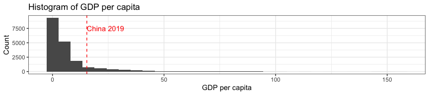

``` r
# How do I get y = 7500? Observe the y-axis in the previous figure.
```

## Annotate Case(s) of Interest (con’d)

``` r
# An automated approach
d |> ggplot(aes(x = gdppc)) + geom_histogram() + 
  geom_vline(data = d_anno, aes(xintercept = gdppc), linetype = "dashed", color = "red") +
  geom_text(data = d_anno, aes(x = gdppc, y = 7500, label = anno), hjust = 0, color = "red") +
  labs(x = "GDP per capita", y = "Count", title = "Histogram of GDP per capita")
```


Why bother with the automated approach? It helps when you want to
annotate multiple cases.

## Annotate Case(s) of Interest (con’d)

``` r
d_anno <- d |> filter(country_text_id %in% c("CHN", "JPN", "USA"), year == 2019) |> 
  mutate(anno = paste(country_text_id, year), .after = year)
print(d_anno)
```

    ## # A tibble: 3 × 10
    ##   country_text_id  year anno     region life_expectancy gdppc population
    ##   <chr>           <dbl> <chr>     <dbl>           <dbl> <dbl>      <dbl>
    ## 1 JPN              2019 JPN 2019     12            84.8  39.1    126633 
    ## 2 USA              2019 USA 2019     16            78.9  60.6    328330.
    ## 3 CHN              2019 CHN 2019     12            77.6  15.4   1407745 
    ## # ℹ 3 more variables: democracy_binary <dbl>, democracy_lexical <dbl>,
    ## #   democracy_polity5 <dbl>

``` r
d |> ggplot(aes(x = gdppc)) + geom_histogram() + 
  geom_vline(data = d_anno, aes(xintercept = gdppc), linetype = "dashed", color = "red") +
  geom_text(data = d_anno, aes(x = gdppc, y = 7500, label = anno), hjust = 0, color = "red") +
  labs(x = "GDP per capita", y = "Count", title = "Histogram of GDP per capita")
```

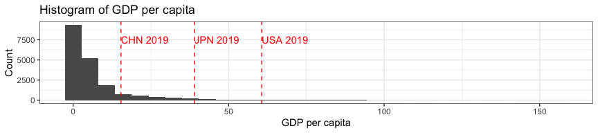

## Annotate Case(s) of Interest (con’d)

``` r
d |> ggplot(aes(x = gdppc)) + 
  geom_density() + 
  geom_vline(data = d_anno, aes(xintercept = gdppc), linetype = "dashed", color = "red") +
  geom_text(data = d_anno, aes(x = gdppc, y = 0.15, label = anno), hjust = 0, color = "red") +
  labs(x = "GDP per capita", y = "Count", title = "Histogram of GDP per capita")
```

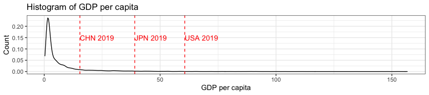

``` r
# Why do I change y to 0.15? Through observation again...
```

# Quant. X 2

## Visualize Two Quantitative Variables

-   Plots

    -   Scatter plot

    -   Scatter plot with a trend line

-   Advanced

    -   Skewed distribution

    -   Annotate data points

    -   2D “Histogram”

-   Summary Statistics: Correlation

## Scatter Plot

``` r
d |> ggplot(aes(x = gdppc, y = life_expectancy)) +
  geom_point() +
  labs(x = "GDP per capita", y = "Life Expectancy", title = "Wealth and Health in the World (1800-2019)")
```

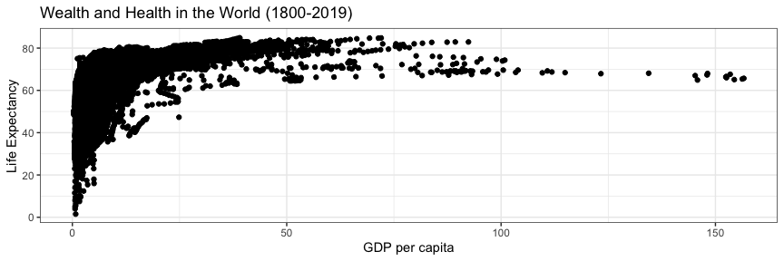

## Scatter Plot (customized)

``` r
d |> ggplot(aes(x = gdppc, y = life_expectancy)) +
  geom_point(alpha = 0.3, color = "navy", shape = 3, size = 0.5, stroke = 1) +
  labs(x = "GDP per capita", y = "Life Expectancy", title = "Wealth and Health in the World (1800-2019)")
```

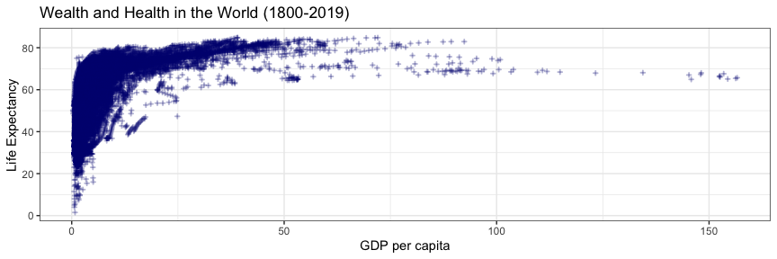

## Scatter Plot with a Trend Line

``` r
d |> ggplot(aes(x = gdppc, y = life_expectancy)) +
  geom_point(alpha = 0.3, shape = 3, size = 0.5) +
  geom_smooth() +
  labs(x = "GDP per capita", y = "Life Expectancy", title = "Wealth and Health in the World (1800-2019)")
```

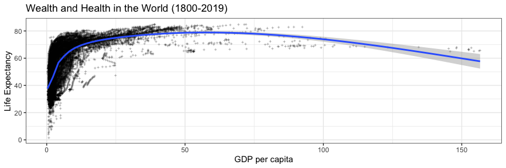

## Scatter Plot with a Trend Line (customized aesthetic)

``` r
d |> ggplot(aes(x = gdppc, y = life_expectancy)) +
  geom_point(alpha = 0.3, shape = 3, size = 0.5) +
  geom_smooth(se = FALSE, color = "red") +
  labs(x = "GDP per capita", y = "Life Expectancy", title = "Wealth and Health in the World (1800-2019)")
```

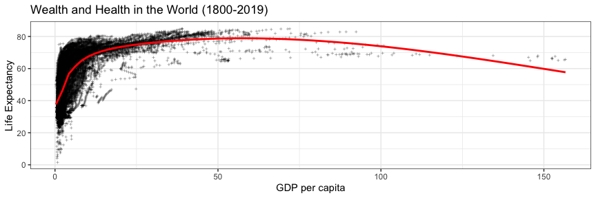

## Scatter Plot with a Trend Line (customized model)

``` r
d |> ggplot(aes(x = gdppc, y = life_expectancy)) +
  geom_point(alpha = 0.3, shape = 3, size = 0.5) +
  geom_smooth(method = "lm") +
  labs(x = "GDP per capita", y = "Life Expectancy", title = "Wealth and Health in the World (1800-2019)")
```

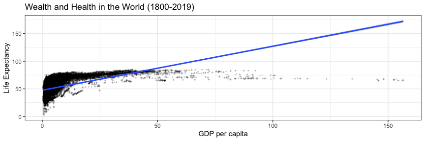

**This is a BAD example, because the relationship between the two
variables is clearly not linear!**

## Skewed Distribution: Re-scale Axes

``` r
d |> ggplot(aes(x = gdppc, y = life_expectancy)) +
  geom_point(alpha = 0.3, color = "navy", shape = 3, size = 0.5, stroke = 1) +
  scale_x_log10() +
  labs(x = "GDP per capita", y = "Life Expectancy", title = "Wealth and Health in the World (1800-2019)")
```


## Skewed Distribution: Transform variables

``` r
d |> 
  mutate(gdppc_log = log(gdppc)) |>
  ggplot(aes(x = gdppc_log, y = life_expectancy)) +
  geom_point(alpha = 0.3, color = "navy", shape = 3, size = 0.5, stroke = 1) +
  labs(x = "log(GDP per capita)", y = "Life Expectancy", title = "Wealth and Health in the World (1800-2019)")
```

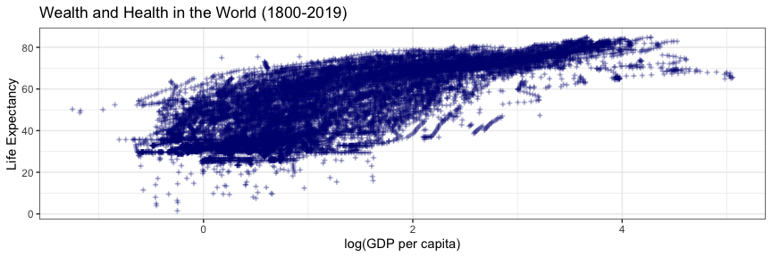

## Annotate Data Points: `geom_text`

``` r
d |> ggplot(aes(x = gdppc, y = life_expectancy)) +
  geom_point(alpha = 0.3, shape = 3, size = 0.5) +
  geom_text(data = d_anno, aes(x = gdppc, y = life_expectancy, label = anno), color = "red", size = 2.5) +
  labs(x = "GDP per capita", y = "Life Expectancy", title = "Wealth and Health in the World (1800-2019)")
```

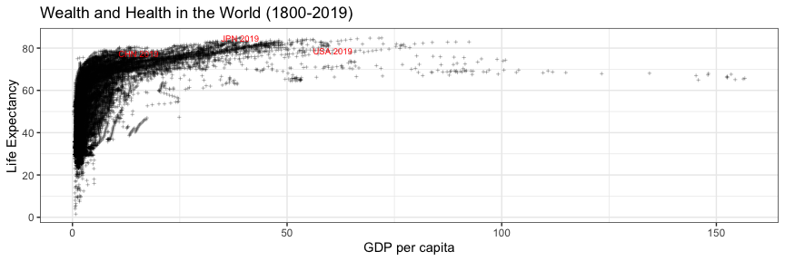

## Annotate Data Points: `geom_label`

`geom_text` might not be able to highlight your data points enough
(especially when your scatter plot has a lot of data points).
`geom_label` may help.

``` r
d |> ggplot(aes(x = gdppc, y = life_expectancy)) +
  geom_point(alpha = 0.3, shape = 3, size = 0.5) +
  geom_label(data = d_anno, aes(x = gdppc, y = life_expectancy, label = anno), color = "red", size = 2.5) +
  labs(x = "GDP per capita", y = "Life Expectancy", title = "Wealth and Health in the World (1800-2019)")
```

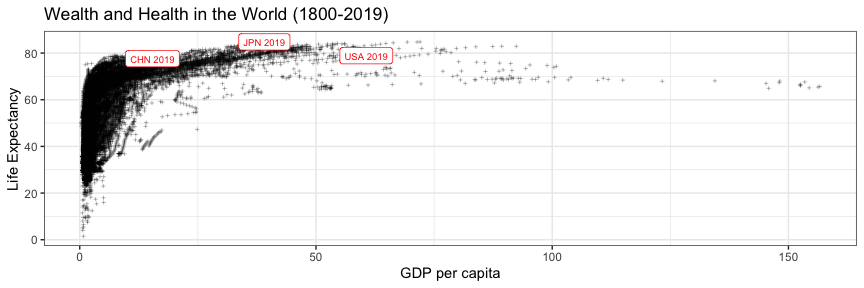

## Annotate MANY Data Points: Problem

`geom_label` and `geom_text` may get you uninformative annotation if the
points you want to annotate cluster in a small area of your figure.

``` r
d_anno_2 <- d |> filter(year >= 2010, country_text_id == "CHN") |> 
  mutate(anno = paste(country_text_id, year), .after = year)

d |> ggplot(aes(x = gdppc, y = life_expectancy)) +
  geom_point(alpha = 0.3, shape = 3, size = 0.5) +
  # geom_point(data = d_anno_2, aes(x = gdppc, y = life_expectancy), color = "red", size = 0.5) +
  geom_label(data = d_anno_2, aes(x = gdppc, y = life_expectancy, label = anno), color = "red", size = 2)
```

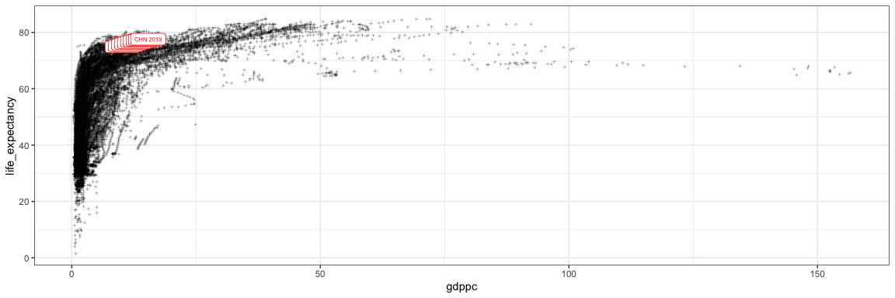

## Annotate MANY Data Points: `geom_label_repel`

When you need to annotate a few points that may cluster in a small area
of your figure, `geom_label_repel` can adjust the labels’ locations to
avoid overlaps.

``` r
library(ggrepel)
d |> ggplot(aes(x = gdppc, y = life_expectancy)) +
  geom_point(alpha = 0.3, shape = 3, size = 0.5) +
  # geom_point(data = d_anno_2, aes(x = gdppc, y = life_expectancy), color = "red", size = 0.5) +
  geom_label_repel(data = d_anno_2, aes(x = gdppc, y = life_expectancy, label = anno), 
                   color = "red", size = 2, max.overlaps = 20) +
  labs(x = "GDP per capita", y = "Life Expectancy", title = "Wealth and Health in the World (1800-2019)")
```

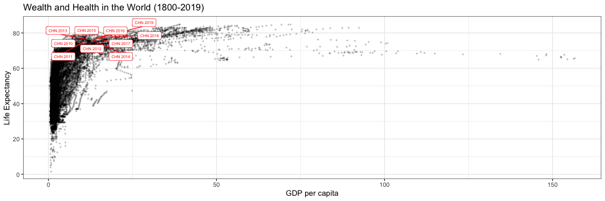

## 2D "Histogram”

``` r
d |> ggplot(aes(x = gdppc, y = life_expectancy)) +
  geom_bin_2d(bins = 80) +
  labs(x = "GDP per capita", y = "Life Expectancy", title = "Wealth and Health in the World (1800-2019)")
```

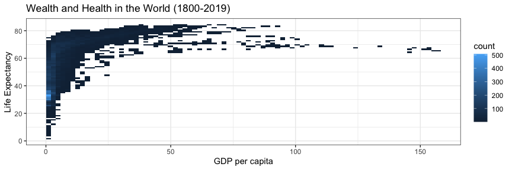

## 2D “Histogram”

``` r
d |> ggplot(aes(x = gdppc, y = life_expectancy)) +
  geom_bin_2d(bins = 80) + scale_x_log10() +
  labs(x = "GDP per capita", y = "Life Expectancy", title = "Wealth and Health in the World (1800-2019)")
```

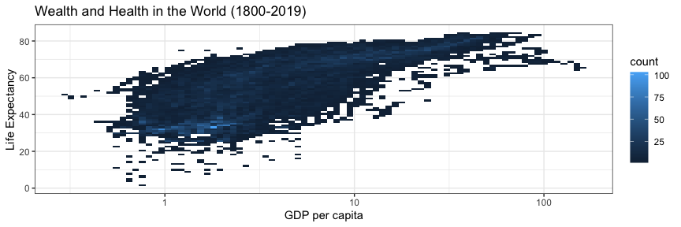

## 2D “Histogram”

If you find the default color scheme (dark to light blue) to no
adequately visualize the different frequencies, you may use a different
scheme that offers higher “contrast” between low and high values.
`scale_fill_viridis_c` is one of my favorite.

``` r
d |> ggplot(aes(x = gdppc, y = life_expectancy)) +
  geom_bin_2d(bins = 80) + scale_x_log10() +
  scale_fill_viridis_c() +
  labs(x = "GDP per capita", y = "Life Expectancy", title = "Wealth and Health in the World (1800-2019)")
```

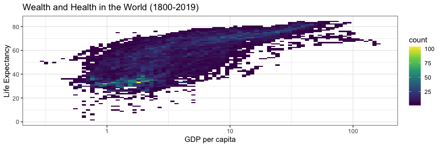

## 2D “Histogram”

``` r
d |> ggplot(aes(x = gdppc, y = life_expectancy)) +
  geom_hex(bins = 80) + scale_x_log10() +
  labs(x = "GDP per capita", y = "Life Expectancy", title = "Wealth and Health in the World (1800-2019)")
```

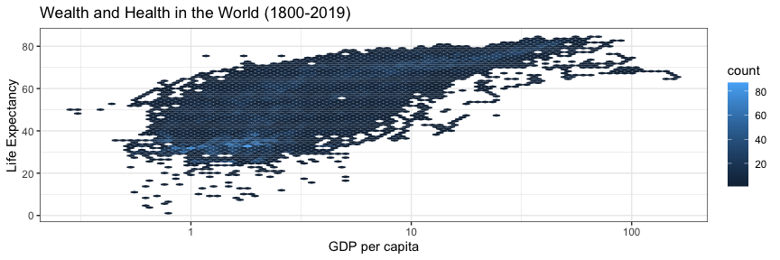

## Summary Statistics: Pearson Correlation

Pearson correlation (aka. Pearson’s *r*), ranging from -1 to 1, is our
typical indicator of the correlation between two quantitative variables.

``` r
cor(d$life_expectancy, d$gdppc, use = "complete.obs", method = "pearson")
```

    ## [1] 0.5600421

``` r
cor.test(d$life_expectancy, d$gdppc, use = "complete.obs", method = "pearson")
```

    ## 
    ##  Pearson's product-moment correlation
    ## 
    ## data:  d$life_expectancy and d$gdppc
    ## t = 92.412, df = 18688, p-value < 2.2e-16
    ## alternative hypothesis: true correlation is not equal to 0
    ## 95 percent confidence interval:
    ##  0.5501224 0.5698037
    ## sample estimates:
    ##       cor 
    ## 0.5600421

## Summary Statistics: Pearson Correlation

To use Pearson correlation, the two variables should meet the following
assumptions:

-   Continuous

-   Linear relationship

-   No outlier

-   Normally distributed

## Summary Statistics: Spearman Correlation

If the data seem to break at least one of the assumptions for Pearson
correlation, you may use Spearman correlation (aka. Spearman’s *ρ*).

``` r
cor(d$life_expectancy, d$gdppc, use = "complete.obs", method = "spearman")
```

    ## [1] 0.767604

``` r
cor.test(d$life_expectancy, d$gdppc, use = "complete.obs", method = "spearman")
```

    ## Warning in cor.test.default(d$life_expectancy, d$gdppc, use = "complete.obs", :
    ## Cannot compute exact p-value with ties

    ## 
    ##  Spearman's rank correlation rho
    ## 
    ## data:  d$life_expectancy and d$gdppc
    ## S = 2.5287e+11, p-value < 2.2e-16
    ## alternative hypothesis: true rho is not equal to 0
    ## sample estimates:
    ##      rho 
    ## 0.767604

# Quant. X 3

## Visualize 3 Quantitative Variables

-   Correlation Matrix

-   Bubble Plot: 3rd variable visualized with size

-   Make it colorful: 3rd variable visualized with color

## Correlation Matrix

``` r
# install.packages("GGally")
library(GGally)
d |>
  select(gdppc, life_expectancy, population) |>
  ggpairs()
```

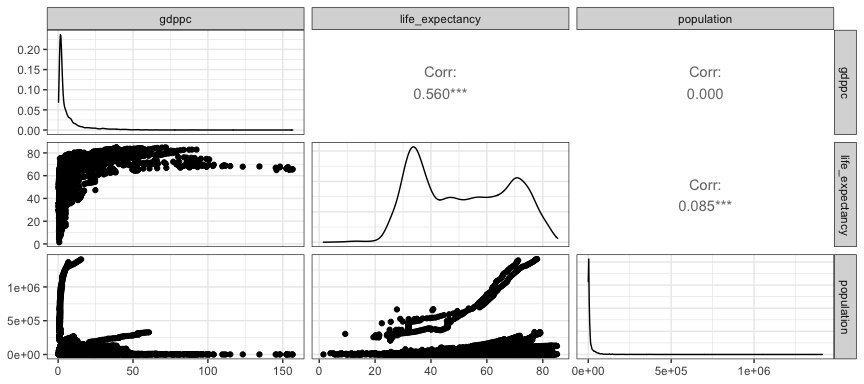

## Correlation Matrix

``` r
d |> select(gdppc, life_expectancy, population) |>
  ggpairs(
    columnLabels = c("GDP per capita", "Life Expectancy", "Population"), # Label variables
    upper = list(continuous = wrap("cor", method = "spearman", color = "blue")), # Upper triangle: Spearman correlation
    diag = list(continuous = wrap("barDiag", bins = 30, fill = "white", color = "black")), # Diagnal: histogram
    lower = list(continuous = wrap("smooth", alpha = 0.1, color = "gray"))) # Lower triag: + linear trend line
```

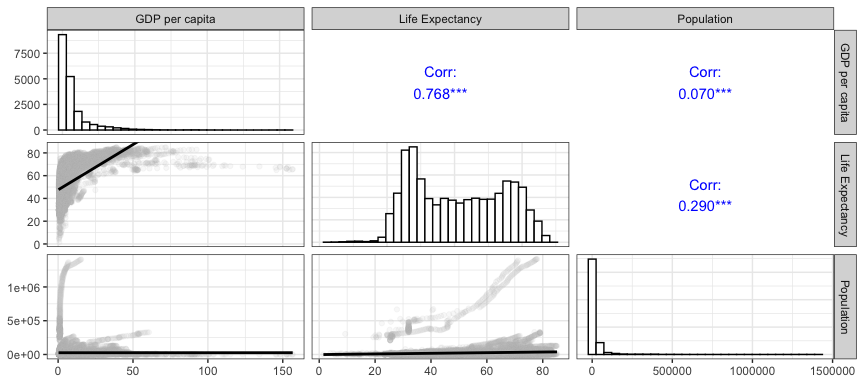

## Correlation Matrix

``` r
d |> select(gdppc, life_expectancy, population) |>
  ggpairs(
    columnLabels = c("GDP per capita", "Life Expectancy", "Population"), # Label variables
    upper = list(continuous = wrap("cor", method = "spearman", color = "blue")), # Upper triangle: Spearman correlation
    diag = list(continuous = wrap("barDiag", bins = 30, fill = "white", color = "black")), # Diagnal: histogram
    lower = list(continuous = wrap("smooth_loess", alpha = 0.1, color = "gray"))) # Lower triag: + loess trend line
```

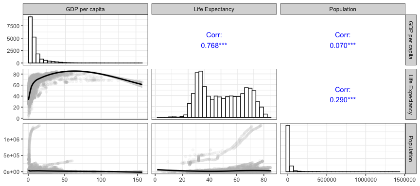

## Correlation Matrix

``` r
summary(d$population) # The population variable is skewed. Consider transofmration
```

    ##      Min.   1st Qu.    Median      Mean   3rd Qu.      Max.      NA's 
    ##      17.9    1246.3    4234.3   23083.3   11914.2 1412360.0      2981

``` r
d |> select(gdppc, life_expectancy, population) |>
  mutate(population = log(population)) |> # log transformation
  ggpairs(
    columnLabels = c("GDP per capita", "Life Expectancy", "log(Population)"), # Label variables
    upper = list(continuous = wrap("cor", method = "spearman", color = "blue")), # Upper triangle: Spearman correlation
    diag = list(continuous = wrap("barDiag", bins = 30, fill = "white", color = "black")), # Diagnal: histogram
    lower = list(continuous = wrap("smooth_loess", alpha = 0.1, color = "gray"))) # Lower triag: + loess trend line
```

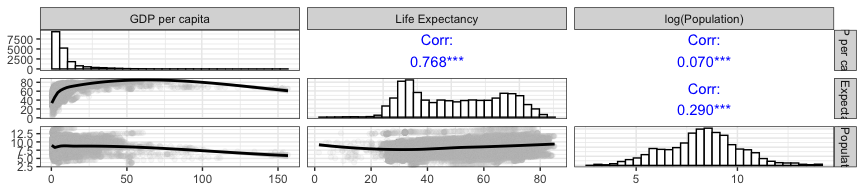

## Play with `ggpairs`

Check out its documentation:
<https://www.rdocumentation.org/packages/GGally/versions/1.5.0/topics/ggpairs>

## Bubble Plot

``` r
d |> 
  filter(year == 2019) |>
  ggplot(aes(x = gdppc, y = life_expectancy)) +
  geom_point(aes(size = population)) +
  labs(x = "GDP per capita", y = "Life Expectancy", title = "Wealth and Health in the World (2019)")
```

    ## Warning: Removed 8 rows containing missing values (geom_point).

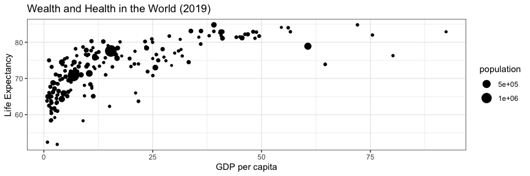

## Bubble Plot (customized)

``` r
d |> 
  filter(year == 2019) |>
  ggplot(aes(x = gdppc, y = life_expectancy)) +
  geom_point(aes(size = population), alpha = 0.3) +
  labs(x = "GDP per capita", y = "Life Expectancy", size = "Population",
       title = "Wealth and Health in the World (2019)")
```

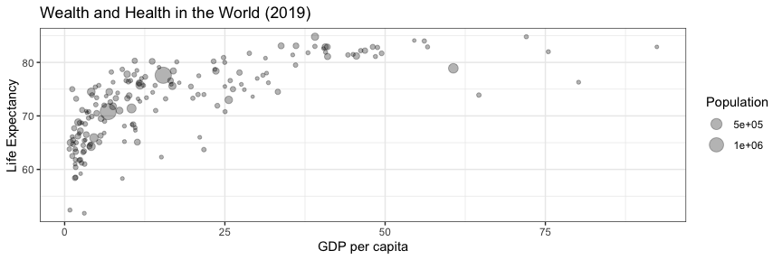

## Bubble Plot (annotated)

``` r
d_anno_pop <- d |> filter(year == 2019) |> slice_max(order_by = population, n = 10)

d |> 
  filter(year == 2019) |>
  ggplot(aes(x = gdppc, y = life_expectancy)) +
  geom_point(aes(size = population), alpha = 0.3) +
  geom_text(data = d_anno_pop, aes(x = gdppc, y = life_expectancy, label = country_text_id, size = population)) +
  labs(x = "GDP per capita", y = "Life Expectancy", size = "Population",
       title = "Wealth and Health in the World (2019)",
       caption = "Note: World's top 10 most populated countries are annotated.") +
  theme(legend.position = "none") # Remove the legend
```

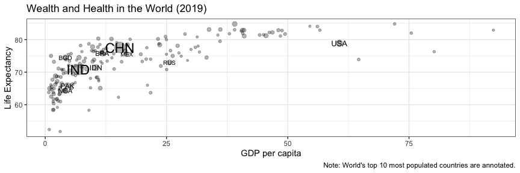

## Make it Colorful

Strengthen the visual message from the third variable

``` r
d |> 
  filter(year == 2019) |>
  ggplot(aes(x = gdppc, y = life_expectancy)) +
  geom_point(aes(size = population, color = population), alpha = 0.3) +
  labs(x = "GDP per capita", y = "Life Expectancy", 
       size = "Population", color = "Population", fill = "Population",
       title = "Wealth and Health in the World (2019)")
```

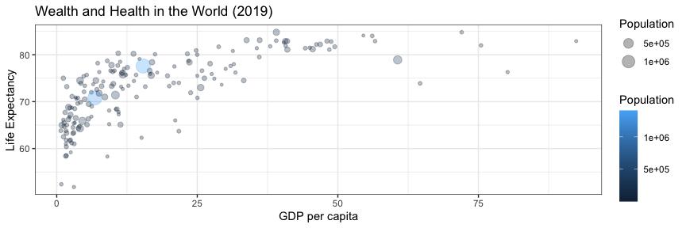

## Make it Colorful (customized)

``` r
d |> 
  filter(year == 2019) |>
  ggplot(aes(x = gdppc, y = life_expectancy)) +
  geom_point(aes(size = population, color = population), alpha = 0.3) +
  scale_color_viridis_c(option = "A", trans = "log", direction = -1) +
  labs(x = "GDP per capita", y = "Life Expectancy", 
       size = "Population", color = "Population", fill = "Population",
       title = "Wealth and Health in the World (2019)")
```

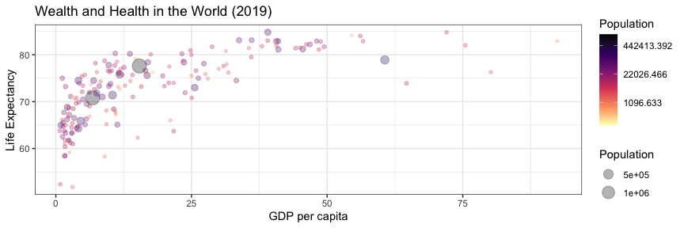

# Quant. X 4+?

## Warning

It is *technically* feasible to plot more than 3 variables in the same
figure, but…

-   You don’t want your figure to be too “busy”

-   “Less is more”
