## Objectives

Master data visualization methods for categorical data with `ggplot`.

-   1 categorical variable

-   1 cat. + 1 quant.

-   1 cat. + 2 quant.

-   2 cat.

-   3 cat.

## Reading Materials on Data Visualization

-   \[Kabacoff\] Kabacoff, Rob. Data Visualization with R. 2020. E-book:
    [rkabacoff.github.io/datavis](https://rkabacoff.github.io/datavis/)

-   \[Healy\] Healy, Kieran. Data visualization: a practical
    introduction. Princeton University Press, 2018. E-book:
    [socviz.co](https://socviz.co/)

# Housekeeping

## Load Data

``` r
library(tidyverse)
theme_set(theme_bw()) # Set my default theme for the whole document

d <- readRDS("Lec_08/data/wealth_and_health.rds")
d |> print(n = 3)
```

    ## # A tibble: 23,593 × 10
    ##   country_text_id  year region life_expectancy gdppc population infant_mortality
    ##   <chr>           <dbl>  <dbl>           <dbl> <dbl>      <dbl>            <dbl>
    ## 1 MEX              1800     17            26.9  1.35      5100               487
    ## 2 MEX              1801     17            26.9  1.34      5174.              487
    ## 3 MEX              1802     17            26.9  1.32      5249.              487
    ## # ℹ 23,590 more rows
    ## # ℹ 3 more variables: democracy_binary <dbl>, democracy_lexical <dbl>,
    ## #   democracy_polity5 <dbl>

## Variable Types

Visualization tools to use largely depends on variable types

-   “Quantitative” (Continuous, Count)

    -   GDP per capita

    -   Life expectancy

    -   Population

    -   Infant mortality

-   **Categorical**

    -   **Binary: Binary “democracy” indicator**

    -   **Nominal: Region**

    -   **Ordinal: Lexical Index of Electoral Democracy**

## Recoding Categorical Data

``` r
table(d$region)
```

    ## 
    ##    1    2    3    4    5    6    7    8    9   10   11   12   13   14   15   16 
    ## 1641 1301 1498 1059  929 1912  993 2364  615 2088  247  988 1536 1233  832  340 
    ##   17   18   19 
    ## 1112 1989  916

## Recoding Categorical Data

``` r
d <- d |>
  mutate(
    region = case_match(
      region,
      1 ~ "Western Europe", 2 ~ "Northern Europe", 3 ~ "Southern Europe",
      4 ~ "Eastern Europe", 5 ~ "Northern Africa", 6 ~ "Western Africa",
      7 ~ "Middle Africa", 8 ~ "Eastern Africa", 9 ~ "Southern Africa",
      10 ~ "Western Asia", 11 ~ "Central Asia", 12 ~ "Eastern Asia",
      13 ~ "South-Eastern Asia", 14 ~ "Southern Asia", 15 ~ "Oceania",
      16 ~ "North America", 17 ~ "Central America", 18 ~ "South America", 19 ~ "Caribbean",
      .default = NA))
```

# Cat. X 1

## Visualize One Categorical Variable

-   Summary Statistics

    -   Count

    -   Proportion

-   Visualization

    -   Bar chart

    -   Needle plot

## Summary Statistics

``` r
summary(d$region) # Quick summary
```

    ##    Length     Class      Mode 
    ##     23593 character character

``` r
length(d$region) # Number of observations
```

    ## [1] 23593

``` r
is.na(d$region) |> sum() # Number of missing values
```

    ## [1] 0

## Summary Statistics (con’d)

``` r
table(d$region, useNA = "always")
```

    ## 
    ##          Caribbean    Central America       Central Asia     Eastern Africa 
    ##                916               1112                247               2364 
    ##       Eastern Asia     Eastern Europe      Middle Africa      North America 
    ##                988               1059                993                340 
    ##    Northern Africa    Northern Europe            Oceania      South America 
    ##                929               1301                832               1989 
    ## South-Eastern Asia    Southern Africa      Southern Asia    Southern Europe 
    ##               1536                615               1233               1498 
    ##     Western Africa       Western Asia     Western Europe               <NA> 
    ##               1912               2088               1641                  0

## Summary Statistics (con’d)

``` r
table(d$region, useNA = "always") |> prop.table()
```

    ## 
    ##          Caribbean    Central America       Central Asia     Eastern Africa 
    ##         0.03882508         0.04713262         0.01046921         0.10019921 
    ##       Eastern Asia     Eastern Europe      Middle Africa      North America 
    ##         0.04187683         0.04488620         0.04208876         0.01441105 
    ##    Northern Africa    Northern Europe            Oceania      South America 
    ##         0.03937609         0.05514347         0.03526470         0.08430467 
    ## South-Eastern Asia    Southern Africa      Southern Asia    Southern Europe 
    ##         0.06510406         0.02606705         0.05226126         0.06349341 
    ##     Western Africa       Western Asia     Western Europe               <NA> 
    ##         0.08104099         0.08850083         0.06955453         0.00000000

## Bar Chart: Default

``` r
d |> ggplot(aes(x = region)) + geom_bar() +
  labs(x = "Region", y = "Count", title = "N. Country-Year by Region")
```

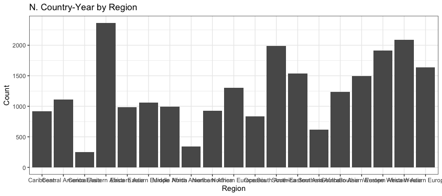

## Bar Chart: Re-orient text labels

Can’t read the text on the x axis? Re-orient it.

``` r
d |> ggplot(aes(x = region)) + geom_bar() +
  theme(axis.text.x = element_text(angle = 90, hjust = 0, vjust = 0)) + # Try: angle = 45
  labs(x = "Region", y = "Count", title = "N. Country-Year by Region")
```

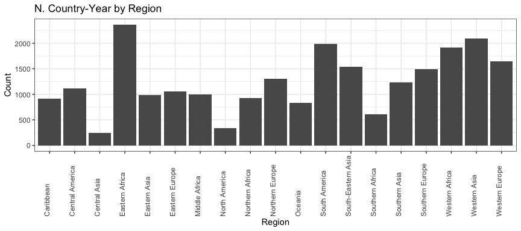

## Bar Chart: Flip the vertical and horizontal axes

``` r
d |> ggplot(aes(x = region)) + geom_bar() +
  coord_flip() +
  labs(x = "Region", y = "Count", title = "N. Country-Year by Region")
```

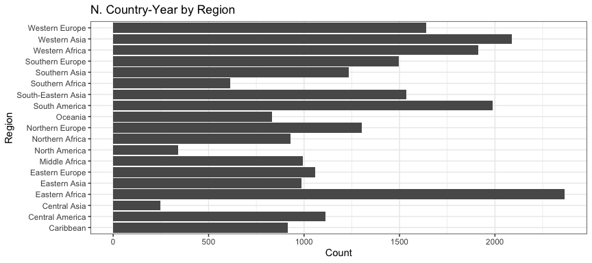

## Bar Chart: Order by Frequency (1)

Order from the most to least frequent category

``` r
d |> ggplot(aes(x = fct_infreq(region))) + geom_bar() +
  theme(axis.text.x = element_text(angle = 90, hjust = 0, vjust = 0)) + # Try: angle = 45
  labs(x = "Region", y = "Count", title = "N. Country-Year by Region")
```

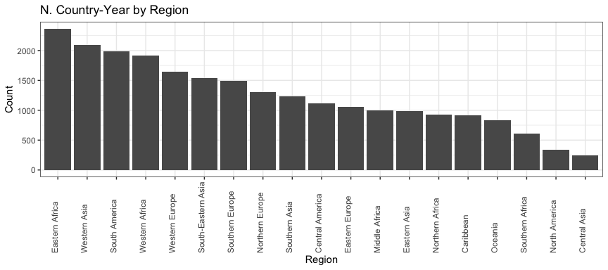

## Bar Chart: Order by Frequency (2)

Order from the least to most frequent category

``` r
d |> ggplot(aes(x = fct_rev(fct_infreq(region)))) + geom_bar() +
  theme(axis.text.x = element_text(angle = 90, hjust = 0, vjust = 0)) +
  labs(x = "Region", y = "Count", title = "N. Country-Year by Region")
```

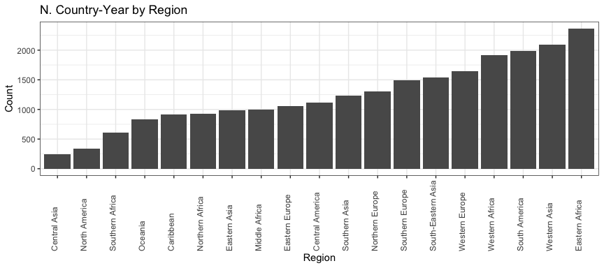

## Bar Chart: Use Your Defined Order

``` r
region_levels <- c(
  "Western Europe", "Northern Europe", "Southern Europe", "Eastern Europe",
  "Northern Africa", "Western Africa", "Middle Africa", "Eastern Africa", "Southern Africa",
  "Western Asia", "Central Asia", "Eastern Asia", "South-Eastern Asia", "Southern Asia",
  "Oceania", 
  "North America", "Central America", "South America", "Caribbean")

d |>
  mutate(region = factor(region, levels = region_levels)) |>
  ggplot(aes(x = region)) + geom_bar() +
  theme(axis.text.x = element_text(angle = 90, hjust = 0, vjust = 0)) +
  labs(x = "Region", y = "Count", title = "N. Country-Year by Region")
```


## Calculate Frequencies before Visualizing

In all the previous examples, we let `ggplot` calculate the frequency
for us. To allow for more customization, a better way is to calculate
the frequencies manually before using `geom_bar`.

``` r
d |> group_by(region) |> summarise(n_obs = n())
```

    ## # A tibble: 19 × 2
    ##    region             n_obs
    ##    <chr>              <int>
    ##  1 Caribbean            916
    ##  2 Central America     1112
    ##  3 Central Asia         247
    ##  4 Eastern Africa      2364
    ##  5 Eastern Asia         988
    ##  6 Eastern Europe      1059
    ##  7 Middle Africa        993
    ##  8 North America        340
    ##  9 Northern Africa      929
    ## 10 Northern Europe     1301
    ## 11 Oceania              832
    ## 12 South America       1989
    ## 13 South-Eastern Asia  1536
    ## 14 Southern Africa      615
    ## 15 Southern Asia       1233
    ## 16 Southern Europe     1498
    ## 17 Western Africa      1912
    ## 18 Western Asia        2088
    ## 19 Western Europe      1641

## Calculate Frequencies before Visualizing

``` r
d |> group_by(region) |> summarise(n_obs = n()) |>
  ggplot(aes(x = reorder(region, -n_obs), y = n_obs)) + geom_bar(stat = "identity") +
  theme(axis.text.x = element_text(angle = 90, hjust = 0, vjust = 0)) +
  labs(x = "Region", y = "Count", title = "N. Country-Year by Region")  
```


## Calculate the Frequencies before Visualizing

``` r
d |> group_by(region) |> summarise(n_obs = n()) |>
  ggplot(aes(y = reorder(region, n_obs), x = n_obs)) + geom_bar(stat = "identity") +
  labs(y = "Region", x = "Count", title = "N. Country-Year by Region")  
```

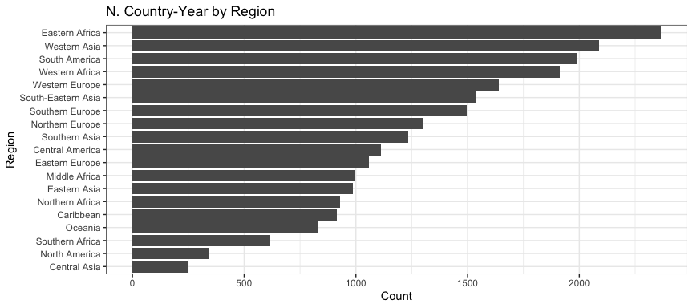

## Too many categories? Recode and Redo the Visualization

An essential technique for the visualization and analysis of categorical
data.

``` r
d <- d |>
  mutate(region_higher = case_match(
    region,
    c("Western Europe", "Northern Europe", "Southern Europe", "Eastern Europe") ~ "Europe",
    c("Northern Africa", "Western Africa", "Middle Africa", "Eastern Africa", "Southern Africa") ~ "Africa",
    c("Western Asia", "Central Asia", "Eastern Asia", "South-Eastern Asia", "Southern Asia") ~ "Asia",
    c("Central America", "South America", "Caribbean") ~ "Latin America",
    .default = region), .before = region)

table(d$region_higher)
```

    ## 
    ##        Africa          Asia        Europe Latin America North America 
    ##          6813          6092          5499          4017           340 
    ##       Oceania 
    ##           832

## Re-do the Visualization

``` r
d |> group_by(region_higher) |> summarise(n_obs = n()) |>
  ggplot(aes(y = reorder(region_higher, n_obs), x = n_obs)) + geom_bar(stat = "identity") +
  labs(y = "Region", x = "Count", title = "N. Country-Year by Region")  
```

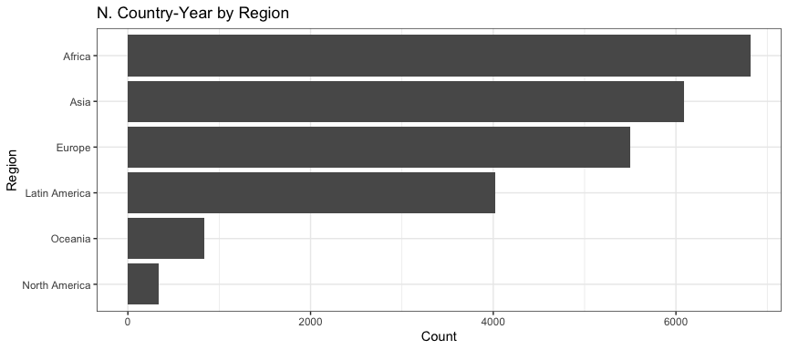

# Cat. X 2

## A Second Variable: Democracy

``` r
table(d$region_higher)
```

    ## 
    ##        Africa          Asia        Europe Latin America North America 
    ##          6813          6092          5499          4017           340 
    ##       Oceania 
    ##           832

## Region and Democracy: Stacked Bar Chart

``` r
d |> group_by(region_higher, democracy_binary) |> summarise(n_obs = n()) |>
  ggplot(aes(x = n_obs, y = region_higher, fill = democracy_binary)) +
  geom_bar(stat = "identity", position = "stack") +
  labs(y = "Region", x = "Count", title = "N. Country-Year by Region and Regime Type", fill = "Democracy")  
```

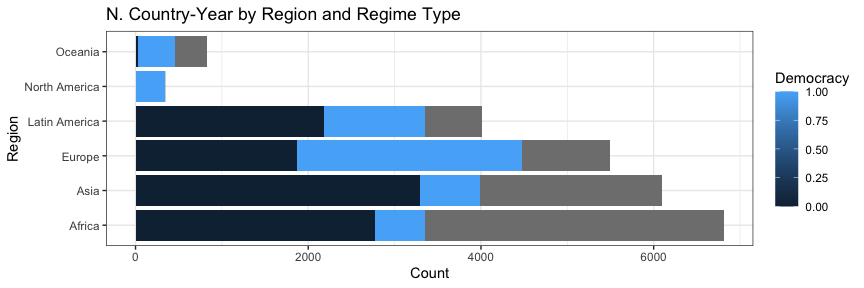

THIS IS WRONG. What’s wrong? `democracy_binary`, a binary variable, is
treated as a quantitative variable.

## Region and Democracy: Stacked Bar Chart (rev. 1)

``` r
d |> group_by(region_higher, democracy_binary) |> summarise(n_obs = n()) |>
  ggplot(aes(x = n_obs, y = region_higher, fill = factor(democracy_binary))) +
  geom_bar(stat = "identity", position = "stack") +
  labs(y = "Region", x = "Count", title = "N. Country-Year by Region and Regime Type", fill = "Democracy")  
```


## Region and Democracy: Stacked Bar Chart (rev. 2)

``` r
d |> group_by(region_higher, democracy_binary) |> summarise(n_obs = n()) |>
  mutate(democracy_binary = case_match(democracy_binary, 1 ~ "Yes", 0 ~ "No", NA ~ NA)) |>
  ggplot(aes(x = n_obs, y = region_higher, fill = democracy_binary)) +
  geom_bar(stat = "identity", position = "stack") +
  labs(y = "Region", x = "Count", title = "N. Country-Year by Region and Regime Type", fill = "Democracy")  
```


## Region and Democracy: Visualize Proportion

``` r
d |> group_by(region_higher, democracy_binary) |> summarise(n_obs = n()) |>
  mutate(democracy_binary = case_match(democracy_binary, 1 ~ "Yes", 0 ~ "No", NA ~ NA)) |>
  group_by(region_higher) |> mutate(prop_obs = n_obs / sum(n_obs) * 100) |> # Calculate proportion
  ggplot(aes(x = prop_obs, y = region_higher, fill = democracy_binary)) +
  geom_bar(stat = "identity", position = "stack") +
  labs(y = "Region", x = "Percentage (%)", title = "N. Country-Year by Region and Regime Type", fill = "Democracy")
```

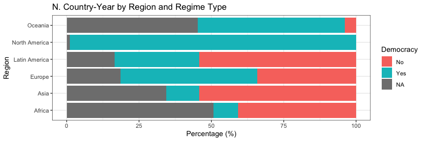

## Annotate the Bar Chart

``` r
d |> group_by(region_higher, democracy_binary) |> summarise(n_obs = n()) |>
  mutate(democracy_binary = case_match(democracy_binary, 1 ~ "Yes", 0 ~ "No", NA ~ NA)) |>
  ggplot(aes(x = n_obs, y = region_higher, fill = democracy_binary)) +
  geom_bar(stat = "identity", position = "stack") +
  geom_text(aes(label = n_obs), position = position_stack(vjust = 0.5), size = 2) +
  labs(y = "Region", x = "Count", title = "N. Country-Year by Region and Regime Type", fill = "Democracy")
```

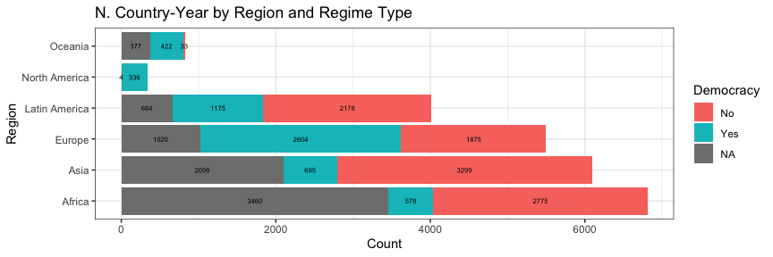

## Annotate the Bar Chart (Proportion)

``` r
d |> group_by(region_higher, democracy_binary) |> summarise(n_obs = n()) |>
  mutate(democracy_binary = case_match(democracy_binary, 1 ~ "Yes", 0 ~ "No", NA ~ NA)) |>
  group_by(region_higher) |> mutate(prop_obs = n_obs / sum(n_obs) * 100) |>
  ggplot(aes(x = prop_obs, y = region_higher, fill = democracy_binary)) +
  geom_bar(stat = "identity", position = "stack") +
  geom_text(aes(label = n_obs), position = position_stack(vjust = 0.5), size = 2) +
  labs(y = "Region", x = "Proportion", title = "N. Country-Year by Region and Regime Type", fill = "Democracy")
```

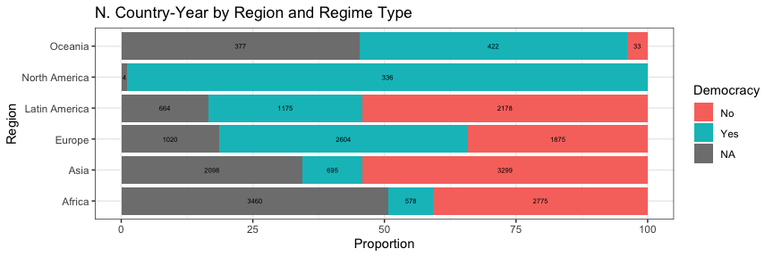

**Note:** I label the *counts*, not the *proportions*, so that readers
can get the proportion from the bar charts and the actual number form
the labels. How do you like it?

# 1 Cat. + 1 Quant.

## Boxplot

``` r
d |> ggplot(aes(x = region_higher, y = life_expectancy)) + 
  geom_boxplot() +
  labs(title = "Life Expectancy by Region", x = "Region", y = "Life Expectancy")
```

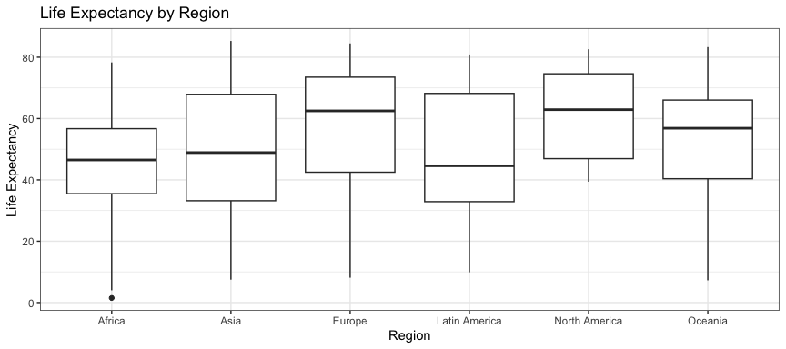

## Boxplot Re-oriented

``` r
d |> ggplot(aes(x = region_higher, y = life_expectancy)) + 
  geom_boxplot() + coord_flip() +
  labs(title = "Life Expectancy by Region", x = "Region", y = "Life Expectancy")
```

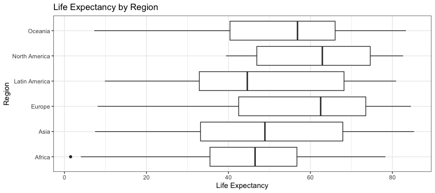

## Boxplot Re-ordered by Median

``` r
d |> 
  filter(!is.na(life_expectancy)) |> # Remove entries whose life_expectancy is NA
  ggplot(aes(x = fct_reorder(region_higher, life_expectancy, .fun=median, .desc = FALSE), y = life_expectancy)) + 
  geom_boxplot() + coord_flip() +
  labs(title = "Life Expectancy by Region", x = "Region", y = "Life Expectancy")
```

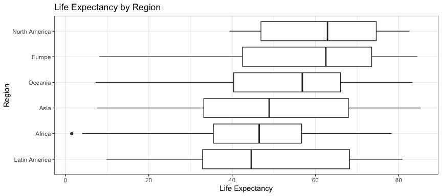

## Boxplot with Actual Data Points

``` r
d |> 
  filter(!is.na(life_expectancy)) |> # Remove entries whose life_expectancy is NA. Essential for the reordering to work!
  ggplot(aes(x = fct_reorder(region_higher, life_expectancy, .fun=median, .desc = FALSE), y = life_expectancy)) + 
  geom_boxplot() + geom_jitter(position = position_jitter(0.3), alpha = 0.1) + # geom_jitter() does the trick.
  coord_flip() + labs(title = "Life Expectancy by Region", x = "Region", y = "Life Expectancy")
```

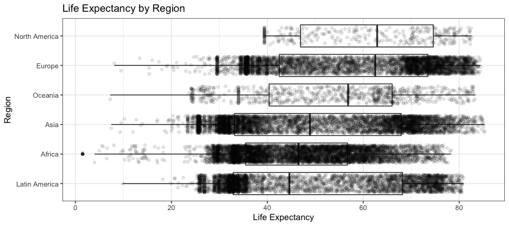

## Violin Plot

``` r
d |> 
  filter(!is.na(life_expectancy)) |> # Remove entries whose life_expectancy is NA
  ggplot(aes(x = fct_reorder(region_higher, life_expectancy, .fun=median, .desc = FALSE), y = life_expectancy)) + 
  geom_violin() +
  coord_flip() + labs(title = "Life Expectancy by Region", x = "Region", y = "Life Expectancy")
```

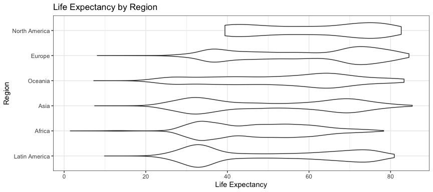

## Boxplot + Violin Plot

``` r
d |> 
  filter(!is.na(life_expectancy)) |> # Remove entries whose life_expectancy is NA
  ggplot(aes(x = fct_reorder(region_higher, life_expectancy, .fun=median, .desc = FALSE), y = life_expectancy)) + 
  geom_violin() + geom_boxplot(width = 0.15, fill = "gray") + # Note: Place geom_boxplot after geom_violin.
  coord_flip() + labs(title = "Life Expectancy by Region", x = "Region", y = "Life Expectancy")
```

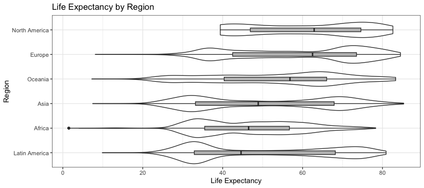

## Colored Histogram

Note: The bars are *stacked*.

``` r
d |>
  ggplot(aes(x = life_expectancy, fill = region_higher)) +
  geom_histogram(bins = 50) + 
  labs(title = "Life Expectancy by Region", fill = "Region", x = "Life Expectancy") +
  theme(legend.position = "bottom")
```

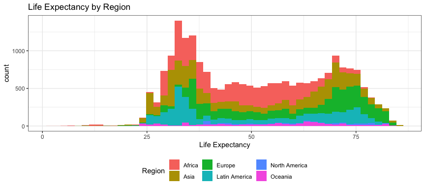

## Colored Frequency Ploygon

``` r
d |>
  ggplot(aes(x = life_expectancy, color = region_higher)) +
  geom_freqpoly(bins = 50) + 
  labs(title = "Life Expectancy by Region", fill = "Region", x = "Life Expectancy") +
  theme(legend.position = "bottom")
```

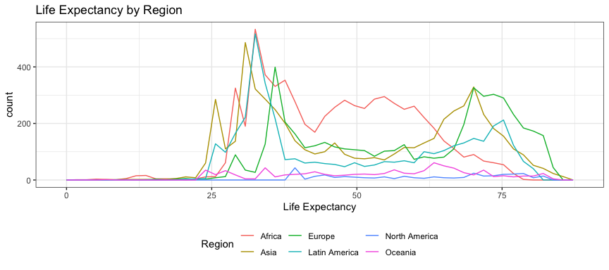

## Colored Density

``` r
d |>
  ggplot(aes(x = life_expectancy, fill = region_higher)) +
  geom_density(alpha = 0.2) + 
  labs(title = "Life Expectancy by Region", fill = "Region", x = "Life Expectancy") +
  theme(legend.position = "bottom")
```

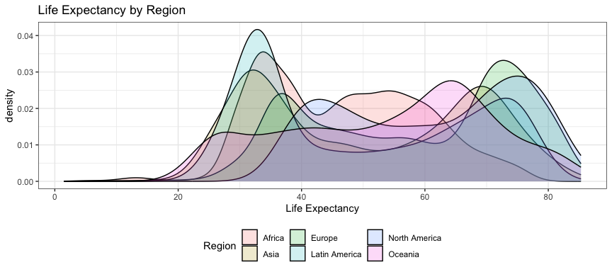

## Colored Density (alternative)

``` r
d |>
  ggplot(aes(x = life_expectancy, fill = NULL, color = region_higher)) +
  geom_density() + 
  labs(title = "Life Expectancy by Region", color = "Region", x = "Life Expectancy") +
  theme(legend.position = "bottom")
```

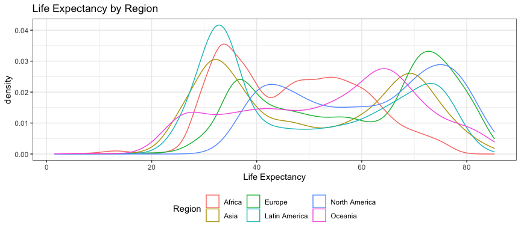

## Use Facets: Split into Columns

Does your figure look too “busy”? Separate them into different
sub-figures!

``` r
d |>
  ggplot(aes(x = life_expectancy, fill = NULL)) +
  geom_density() + 
  labs(title = "Life Expectancy by Region", color = "Region", x = "Life Expectancy") +
  theme(legend.position = "bottom") +
  facet_grid(cols = vars(region_higher))
```


## Use Facets: Split into Rows

``` r
d |>
  ggplot(aes(x = life_expectancy, fill = NULL)) +
  geom_density() + 
  labs(title = "Life Expectancy by Region", color = "Region", x = "Life Expectancy") +
  theme(legend.position = "bottom") +
  facet_grid(rows = vars(region_higher))
```

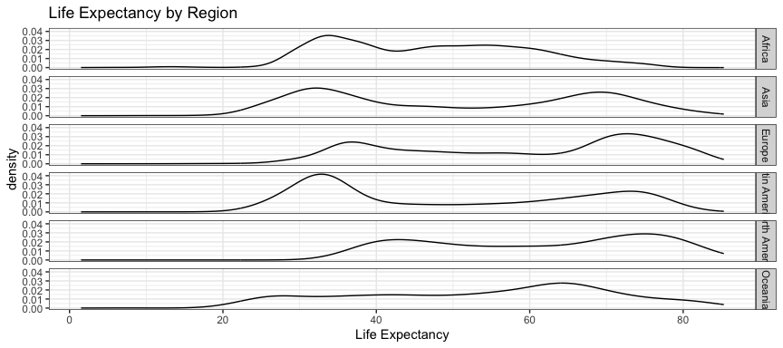

## Use Facets: Flexible Organization

``` r
d |>
  ggplot(aes(x = life_expectancy, fill = NULL)) +
  geom_density() + 
  labs(title = "Life Expectancy by Region", color = "Region", x = "Life Expectancy") +
  theme(legend.position = "bottom") +
  facet_wrap(~region_higher, nrow = 2)
```

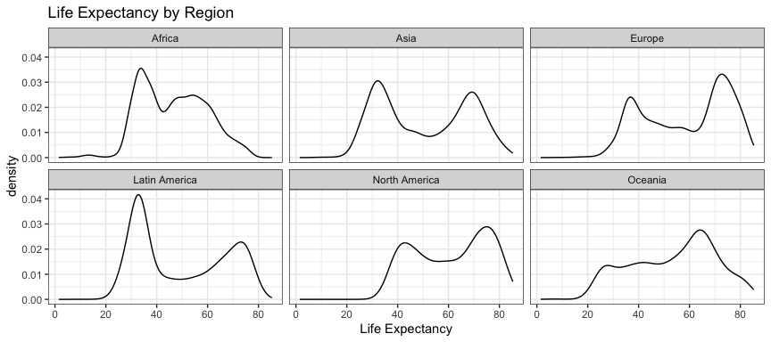

# 1 Cat. + 2 Quant.

## The 2 Quant. Plot We Did Last Time

``` r
d |> ggplot(aes(x = gdppc, y = life_expectancy)) +
  geom_point(alpha = 0.3, color = "navy", shape = 3, size = 0.5, stroke = 1) +
  labs(x = "GDP per capita", y = "Life Expectancy", title = "Wealth and Health in the World (1800-2019)")
```

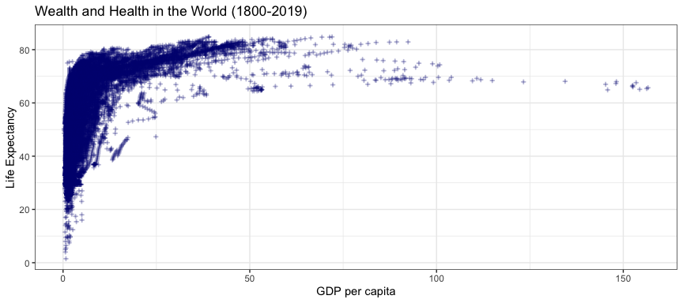

## Scatter Plot: Categorical Variable as Color

``` r
d |> ggplot(aes(x = gdppc, y = life_expectancy)) +
  geom_point(aes(color = region_higher), alpha = 0.3, shape = 3, size = 0.5, stroke = 1) +
  labs(x = "GDP per capita", y = "Life Expectancy", color = "Region",
       title = "Wealth and Health in the World (1800-2019)")
```

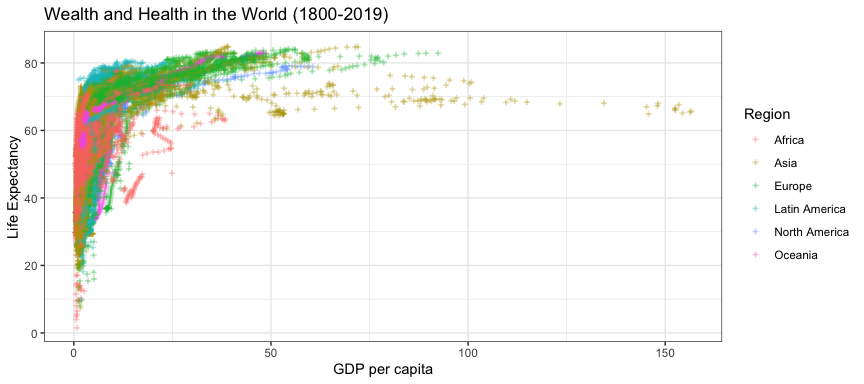

## Scatter Plot: Categorical Variable as Shape

``` r
d |> ggplot(aes(x = gdppc, y = life_expectancy)) +
  geom_point(aes(shape = region_higher), alpha = 0.3, size = 0.5, stroke = 1) +
  labs(x = "GDP per capita", y = "Life Expectancy", shape = "Region",
       title = "Wealth and Health in the World (1800-2019)")
```

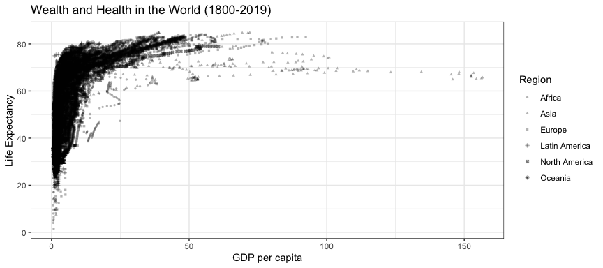

## Scatter Plot: Categorical Variable as Color and Shape

``` r
d |> ggplot(aes(x = gdppc, y = life_expectancy)) +
  geom_point(aes(shape = region_higher, color = region_higher), alpha = 0.3, size = 0.5, stroke = 1) +
  labs(x = "GDP per capita", y = "Life Expectancy", color = "Region", shape = "Region",
       title = "Wealth and Health in the World (1800-2019)")
```

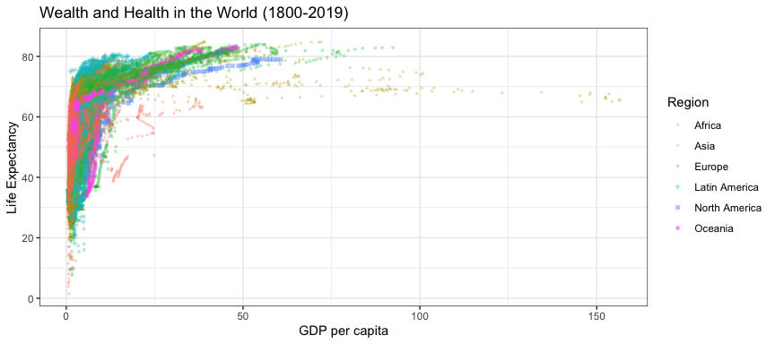

## Scatter Plot with One Trend Line

``` r
d |> ggplot(aes(x = gdppc, y = life_expectancy)) +
  geom_point(aes(shape = region_higher, color = region_higher), alpha = 0.3, size = 0.5, stroke = 1) +
  geom_smooth() +
  labs(x = "GDP per capita", y = "Life Expectancy", color = "Region", shape = "Region",
       title = "Wealth and Health in the World (1800-2019)")
```

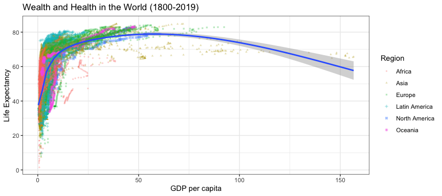

## Scatter Plot with Separate Trend Lines

``` r
d |> ggplot(aes(x = gdppc, y = life_expectancy)) +
  geom_point(aes(shape = region_higher, color = region_higher), alpha = 0.3, size = 0.5, stroke = 1) +
  geom_smooth(aes(color = region_higher)) +
  labs(x = "GDP per capita", y = "Life Expectancy", color = "Region", shape = "Region",
       title = "Wealth and Health in the World (1800-2019)")
```

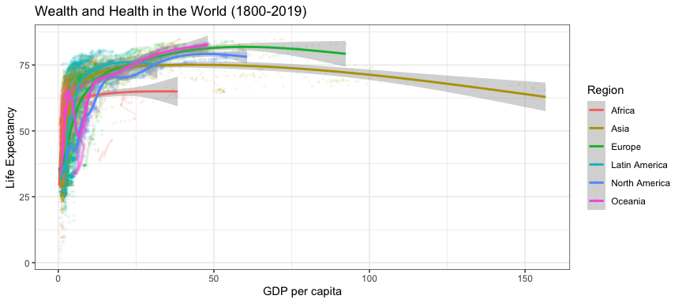

## Use Facets 1

``` r
d |> ggplot(aes(x = gdppc, y = life_expectancy)) +
  geom_point(alpha = 0.3, size = 0.5, stroke = 1) +
  geom_smooth() +
  labs(x = "GDP per capita", y = "Life Expectancy", color = "Region", shape = "Region",
       title = "Wealth and Health in the World (1800-2019)") +
  facet_wrap(~region_higher, nrow = 2)
```

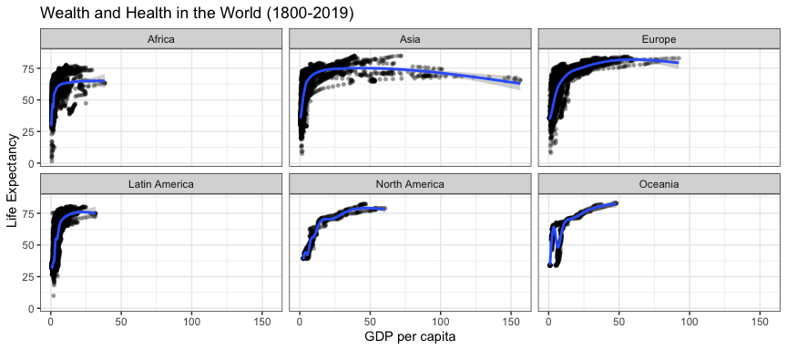

## Use Facets 2

``` r
d |> ggplot(aes(x = gdppc, y = life_expectancy)) +
  geom_point(alpha = 0.3, size = 0.5, stroke = 1) +
  geom_smooth() +
  labs(x = "GDP per capita", y = "Life Expectancy", color = "Region", shape = "Region",
       title = "Wealth and Health in the World (1800-2019)") +
  facet_wrap(~region_higher, nrow = 2, scales = "free")
```

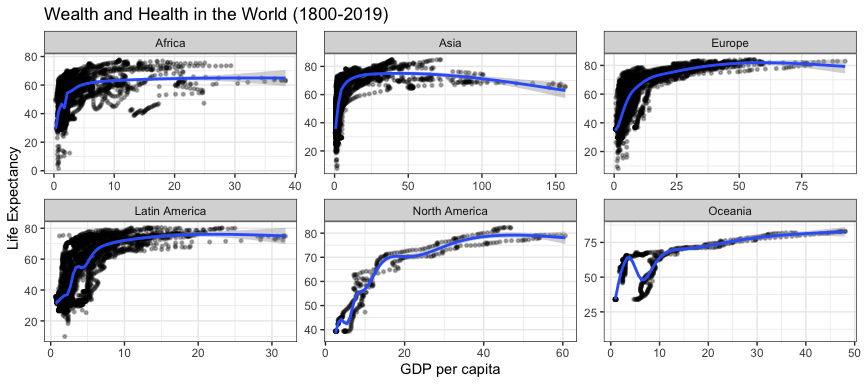

## If you really want a colorful faceted plot…

You don’t really *need* the different colors though…

``` r
d |> ggplot(aes(x = gdppc, y = life_expectancy)) +
  geom_point(aes(shape = region_higher, color = region_higher), alpha = 0.3, size = 0.5, stroke = 1) +
  geom_smooth() +
  labs(x = "GDP per capita", y = "Life Expectancy", color = "Region", shape = "Region",
       title = "Wealth and Health in the World (1800-2019)") +
  facet_wrap(~region_higher, nrow = 2, scales = "free") +
  theme(legend.position = "none")
```

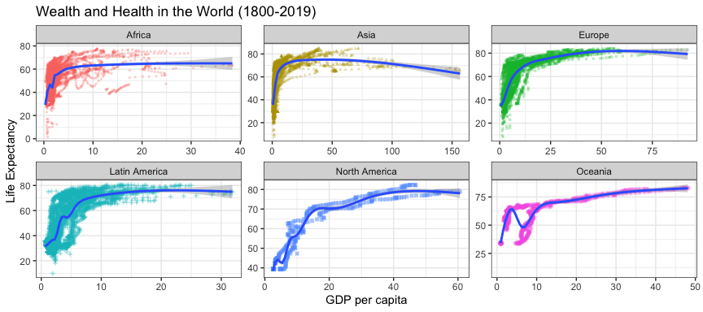

# 2 Cat. + 1 Quant.

## Heatmap

``` r
d |> filter(year >= 1984) |>
  group_by(region_higher, year) |> summarise(life_expectancy_avg = mean(life_expectancy, na.rm = TRUE)) |> mutate(year = factor(year)) |>
  ggplot(aes(x = year, y = region_higher, fill = life_expectancy_avg)) + geom_tile() +
  theme(axis.text.x = element_text(angle = 45), legend.position = "bottom") +
  labs(x = "Year", y = "Region", fill = "Life Expectancy", title = "Life Expectancy by Region-Year")
```

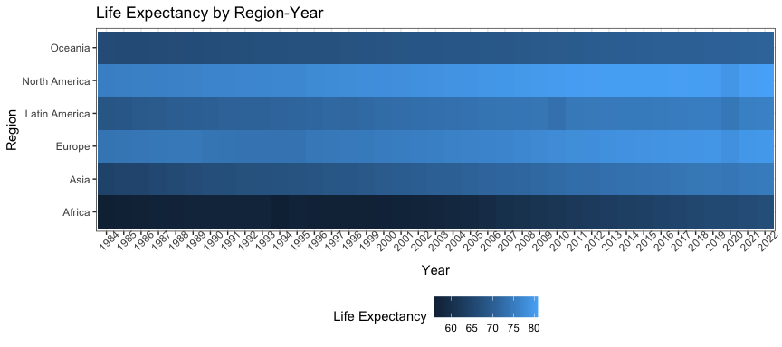

## Heatmap: Changed Color Palette

``` r
d |> filter(year >= 1984) |>
  group_by(region_higher, year) |> summarise(life_expectancy_avg = mean(life_expectancy, na.rm = TRUE)) |> mutate(year = factor(year)) |>
  ggplot(aes(x = year, y = region_higher, fill = life_expectancy_avg)) + geom_tile() +
  theme(axis.text.x = element_text(angle = 45), legend.position = "bottom") +
  scale_fill_viridis_c(option = "A", direction = 1) +
  labs(x = "Year", y = "Region", fill = "Life Expectancy", title = "Life Expectancy by Region-Year")
```

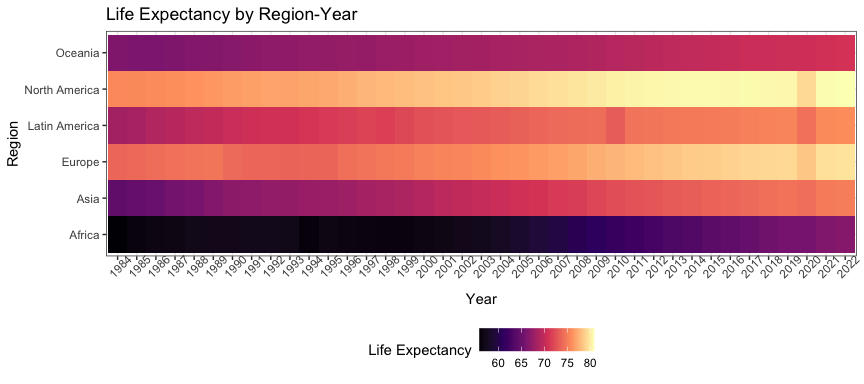

## Facets: Density Plot Matrix `facet_grid`

``` r
d |> filter(year %in% 2010:2020) |> ggplot(aes(x = life_expectancy)) + geom_density() +
  facet_grid(cols = vars(region_higher), rows = vars(year)) +
  labs(x = "Life Expectancy", y = "Density", title = "Life Expectancy by Region-Year (2010-2022)")
```

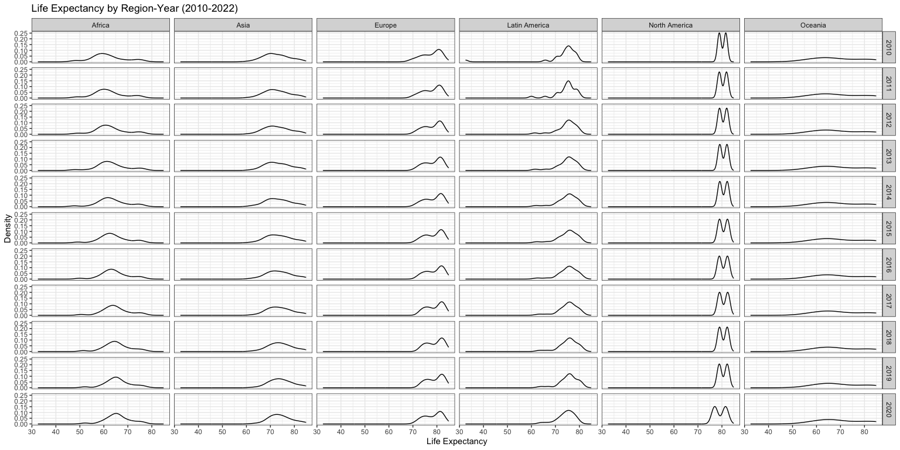

## Facets: Density Plot Matrix (Free Scales on x)

``` r
d |> filter(year %in% 2010:2020) |> ggplot(aes(x = life_expectancy)) + geom_density() +
  facet_grid(cols = vars(region_higher), rows = vars(year), scales = "free_x") +
  labs(x = "Life Expectancy", y = "Density", title = "Life Expectancy by Region-Year (2010-2022)")
```

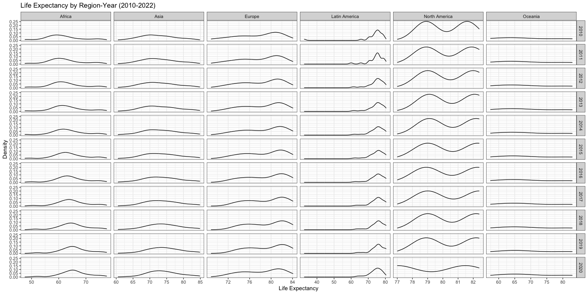

## Facets: Density Plot Matrix (Free Scales on y)

``` r
d |> filter(year %in% 2010:2020) |> ggplot(aes(x = life_expectancy)) + geom_density() +
  facet_grid(cols = vars(region_higher), rows = vars(year), scales = "free_y") +
  labs(x = "Life Expectancy", y = "Density", title = "Life Expectancy by Region-Year (2010-2022)")
```

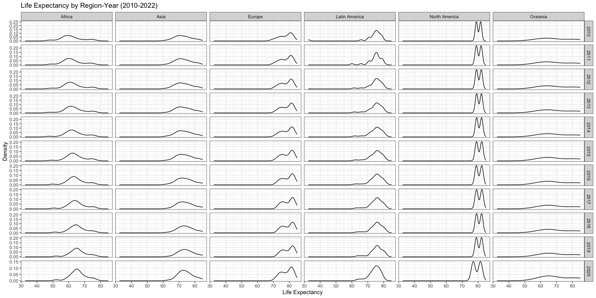

## Facets: Density Plot Matrix (Free Scales on both dimensions)

``` r
d |> filter(year %in% 2010:2020) |> ggplot(aes(x = life_expectancy)) + geom_density() +
  facet_grid(cols = vars(region_higher), rows = vars(year), scales = "free") +
  labs(x = "Life Expectancy", y = "Density", title = "Life Expectancy by Region-Year (2010-2022)")
```

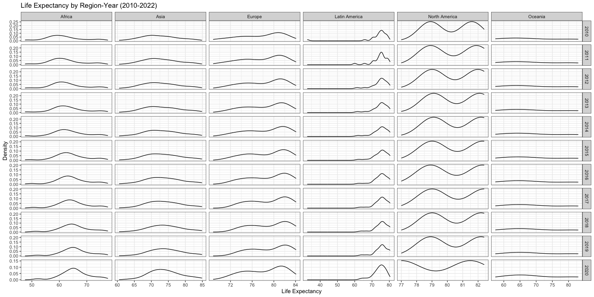

# Many Quant. & Cat.

## Correlation Matrix

``` r
library(GGally)

d |> filter(year == 2019) |>select(gdppc, life_expectancy, population, region_higher) |>
  mutate(population = log(population)) |>
  ggpairs(
    columnLabels = c("GDP per capita", "Life Expectancy", "log(Population)", "Region"), # Label variables
    upper = list(continuous = wrap("cor", method = "spearman", color = "blue")),
    diag = list(continuous = wrap("barDiag", bins = 30, fill = "white", color = "black")), 
    lower = list(continuous = wrap("smooth_loess", alpha = 0.3, color = "gray")))
```

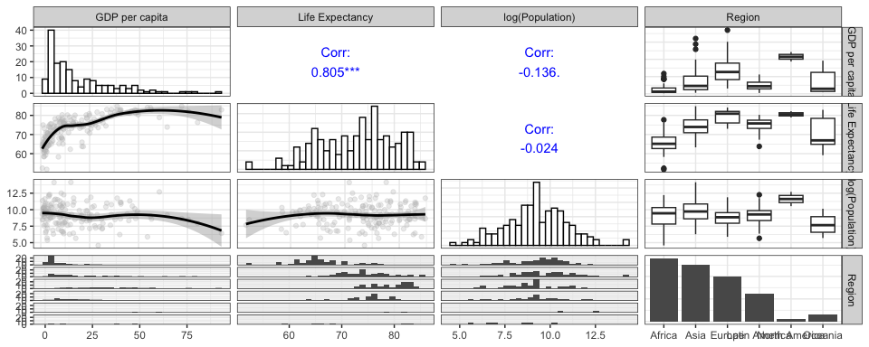
