# Housekeeping

## Objectives

Master data visualization methods for spatial-temporal data with
`ggplot`

-   Time series data
    -   One time series
    -   Multiple time series
-   Spatial data
    -   Color
    -   Bubble
    -   Size
-   Spatial-temporal data

## Reading Materials on Data Visualization

-   \[Kabacoff\] Kabacoff, Rob. Data Visualization with R. 2020. E-book:
    [rkabacoff.github.io/datavis](https://rkabacoff.github.io/datavis/)

-   \[Healy\] Healy, Kieran. Data visualization: a practical
    introduction. Princeton University Press, 2018. E-book:
    [socviz.co](https://socviz.co/)

## Load Data

``` r
library(tidyverse)
theme_set(theme_bw()) # Set my default theme for the whole document

d <- readRDS("Lec_08/data/wealth_and_health.rds")
d |> print(n = 3)
```

    ## # A tibble: 23,593 × 10
    ##   country_text_id  year region life_expectancy gdppc population infant_mortality
    ##   <chr>           <dbl>  <dbl>           <dbl> <dbl>      <dbl>            <dbl>
    ## 1 MEX              1800     17            26.9  1.35      5100               487
    ## 2 MEX              1801     17            26.9  1.34      5174.              487
    ## 3 MEX              1802     17            26.9  1.32      5249.              487
    ## # ℹ 23,590 more rows
    ## # ℹ 3 more variables: democracy_binary <dbl>, democracy_lexical <dbl>,
    ## #   democracy_polity5 <dbl>

## Recode `region` Indicator

``` r
d <- d |>
  mutate(
    region = case_match(
      region,
      1 ~ "Western Europe", 2 ~ "Northern Europe", 3 ~ "Southern Europe",
      4 ~ "Eastern Europe", 5 ~ "Northern Africa", 6 ~ "Western Africa",
      7 ~ "Middle Africa", 8 ~ "Eastern Africa", 9 ~ "Southern Africa",
      10 ~ "Western Asia", 11 ~ "Central Asia", 12 ~ "Eastern Asia",
      13 ~ "South-Eastern Asia", 14 ~ "Southern Asia", 15 ~ "Oceania",
      16 ~ "North America", 17 ~ "Central America", 18 ~ "South America", 19 ~ "Caribbean",
      .default = NA))
table(d$region)
```

    ## 
    ##          Caribbean    Central America       Central Asia     Eastern Africa 
    ##                916               1112                247               2364 
    ##       Eastern Asia     Eastern Europe      Middle Africa      North America 
    ##                988               1059                993                340 
    ##    Northern Africa    Northern Europe            Oceania      South America 
    ##                929               1301                832               1989 
    ## South-Eastern Asia    Southern Africa      Southern Asia    Southern Europe 
    ##               1536                615               1233               1498 
    ##     Western Africa       Western Asia     Western Europe 
    ##               1912               2088               1641

# One Time Series

## Life Expectancy in China: Dots

``` r
d |> filter(country_text_id == "CHN") |>
  ggplot(aes(x = year, y = life_expectancy)) + geom_point(alpha = 0.5) +
  labs(x = "Year", y = "Life Expectancy", title = "Life Expectancy in China")
```

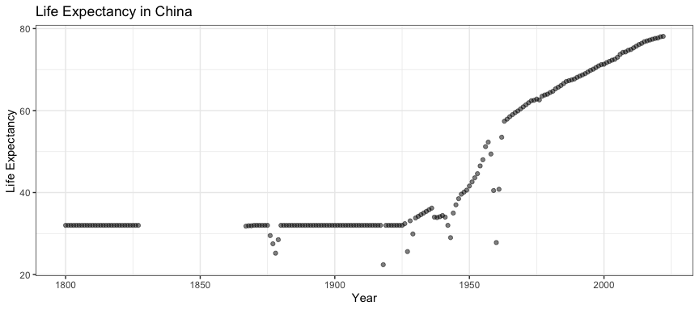

## Life Expectancy in China: Line

``` r
d |> filter(country_text_id == "CHN") |>
  ggplot(aes(x = year, y = life_expectancy)) + geom_line() +
  labs(x = "Year", y = "Life Expectancy", title = "Life Expectancy in China")
```

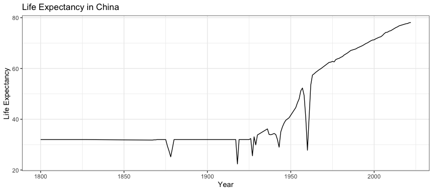

## Life Expectancy in China: Dots + Trend Line

``` r
d |> filter(country_text_id == "CHN") |>
  ggplot(aes(x = year, y = life_expectancy)) + geom_point(alpha = 0.5) + geom_smooth() +
  labs(x = "Year", y = "Life Expectancy", title = "Life Expectancy in China")
```

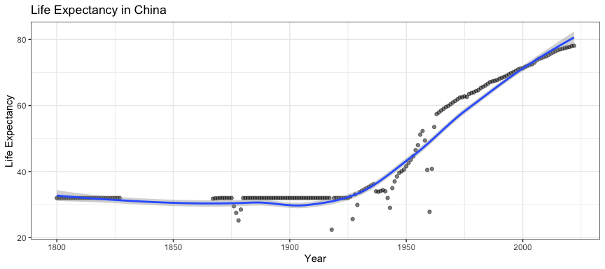

# Multiple Time Series (Same Variable)

## Life Expectancy in Eastern Asia (Points)

``` r
d |> filter(region == "Eastern Asia") |>
  ggplot(aes(x = year, y = life_expectancy, color = country_text_id)) + geom_point(alpha = 0.5) +
  labs(x = "Year", y = "Life Expectancy", title = "Life Expectancy in Eastern Asia", color = "Country/Region")
```

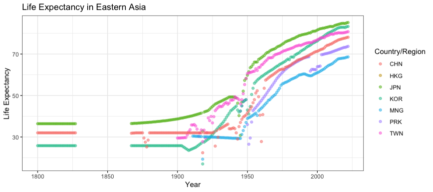

## Life Expectancy in Eastern Asia (Points, Facets)

``` r
d |> filter(region == "Eastern Asia") |>
  ggplot(aes(x = year, y = life_expectancy, color = country_text_id)) + geom_point(alpha = 0.5) +
  facet_wrap(~country_text_id, nrow = 2) +
  labs(x = "Year", y = "Life Expectancy", title = "Life Expectancy in Eastern Asia", color = "Country/Region") + 
  theme(legend.position = "none")
```

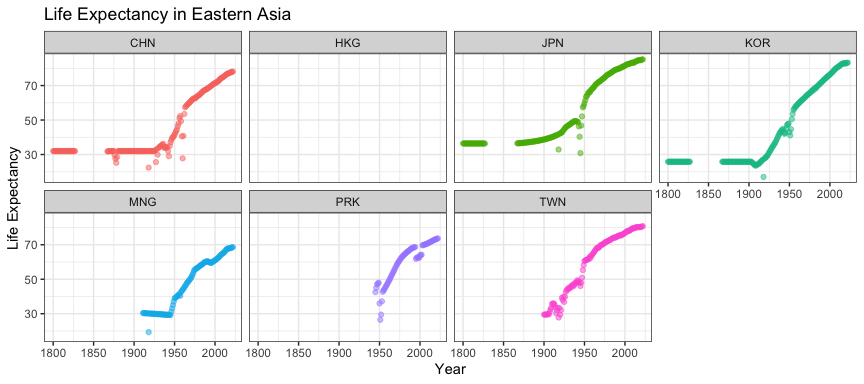

## Life Expectancy in Eastern Asia (Points+Trends)

``` r
d |> filter(region == "Eastern Asia") |>
  ggplot(aes(x = year, y = life_expectancy, color = country_text_id)) + geom_point(alpha = 0.2) + geom_smooth() +
  labs(x = "Year", y = "Life Expectancy", title = "Life Expectancy in Eastern Asia", color = "Country/Region")
```

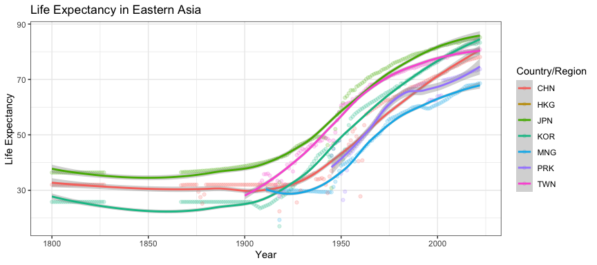

## Life Expectancy in Eastern Asia (Points+Trends, Facets)

``` r
d |> filter(region == "Eastern Asia") |>
  ggplot(aes(x = year, y = life_expectancy, color = country_text_id)) + geom_point(alpha = 0.2) + geom_smooth() +
  facet_wrap(~country_text_id, nrow = 2) +
  labs(x = "Year", y = "Life Expectancy", title = "Life Expectancy in Eastern Asia", color = "Country/Region") + 
  theme(legend.position = "none")
```

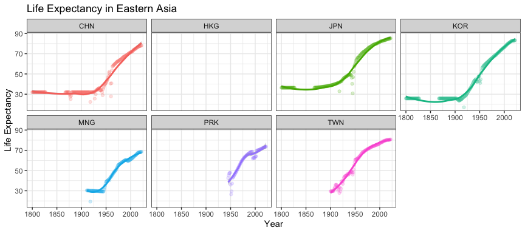

## Life Expectancy in Eastern Asia (Annotate Critical Time Point)

``` r
d |> filter(region == "Eastern Asia") |>
  ggplot(aes(x = year, y = life_expectancy, color = country_text_id)) + geom_point(alpha = 0.2) + geom_smooth() +
  geom_vline(xintercept = 2000, color = "red", linetype = "dashed") + # Add a vertical line at year 2000
  geom_hline(yintercept = 70, color = "red", linetype = "dashed") +  # Add a vertical line at 70 years old
  facet_wrap(~country_text_id, nrow = 2) +
  labs(x = "Year", y = "Life Expectancy", title = "Life Expectancy in Eastern Asia", color = "Country/Region") + 
  theme(legend.position = "none")
```

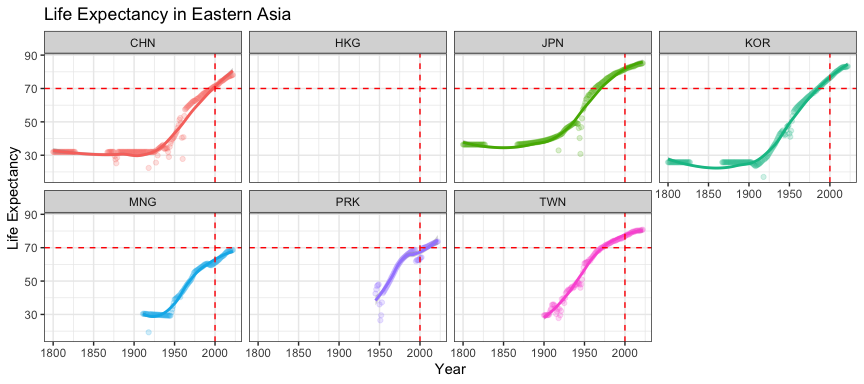

## Life Expectancy in Eastern Asia (Annotate Critical Time Period)

``` r
d |> filter(region == "Eastern Asia") |>
  ggplot(aes(x = year, y = life_expectancy, color = country_text_id)) + 
  annotate("rect", xmin = 1984, xmax = 2020, ymin = -Inf, ymax = Inf, alpha = 0.3, fill = "yellow", color = "red", linetype = "dashed") +
  geom_point(alpha = 0.2) + geom_smooth() + facet_wrap(~country_text_id, nrow = 2) +
  labs(x = "Year", y = "Life Expectancy", title = "Life Expectancy in Eastern Asia", color = "Country/Region") + 
  theme(legend.position = "none")
```

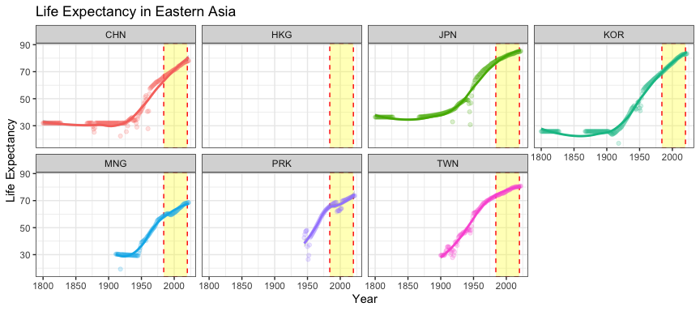

# Multiple Time Series (Different Variables)

## Evolution of “Health” and “Wealth” in China (Stack –)

``` r
library(patchwork) # Package that allow you to "stack" multiple ggplot objects
p_LifeExpectancy <- d |> filter(country_text_id == "CHN") |>
  ggplot(aes(x = year, y = life_expectancy)) + geom_point(alpha = 0.3) + geom_smooth() +
  labs(x = "Year", y = "Life Expectancy", title = "Health in China")
p_gdppc <- d |> filter(country_text_id == "CHN") |>
  ggplot(aes(x = year, y = gdppc)) + geom_point(alpha = 0.3) + geom_smooth() +
  labs(x = "Year", y = "GDP per capita", title = "Wealth in China")
p_LifeExpectancy + p_gdppc # Stack two ggplot objects horizontally with "+"
```

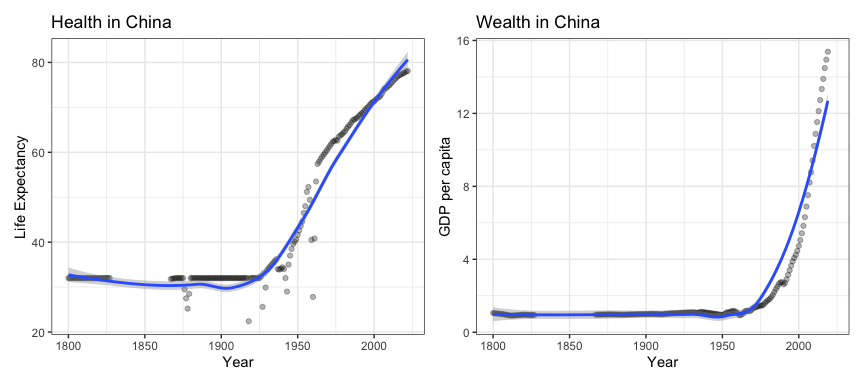

## Evolution of “Health” and “Wealth” in China (Stack \|)

``` r
p_LifeExpectancy / p_gdppc # Stack two ggplot objects vertically with "/"
```

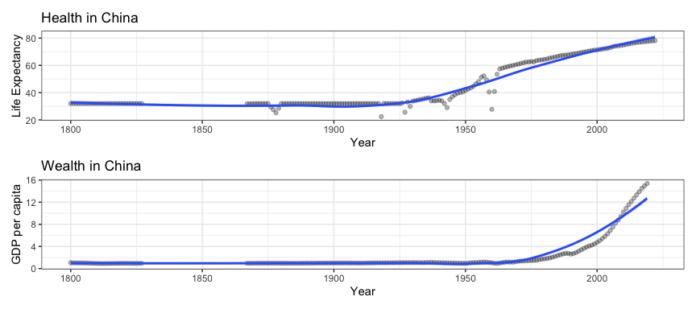

## Evolution of “Health” and “Wealth” in China (Secondary Axis)

**WARNING:** This type of figures can be <u>**confusing**</u> and
<u>**misleading**</u>. Unadvised!

``` r
coef <- 5
d |> filter(country_text_id == "CHN") |>
  ggplot(aes(x = year)) + 
  geom_line(aes(y = life_expectancy), color = "blue", size = 1) + 
  geom_line(aes(y = gdppc * coef), color = "red", size = 1) +
  scale_y_continuous(name = "Life Expectancy", sec.axis = sec_axis(~./coef, name = "GDP per capita")) +
  theme(axis.title.y.left = element_text(color = "blue"), axis.title.y.right = element_text(color = "red")) +
  labs(x = "Year", title = "GDP")
```

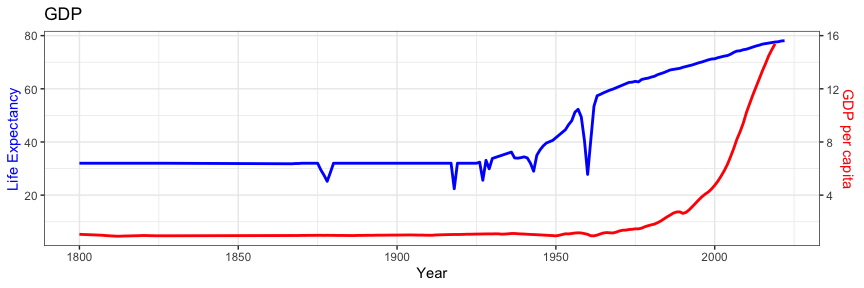
